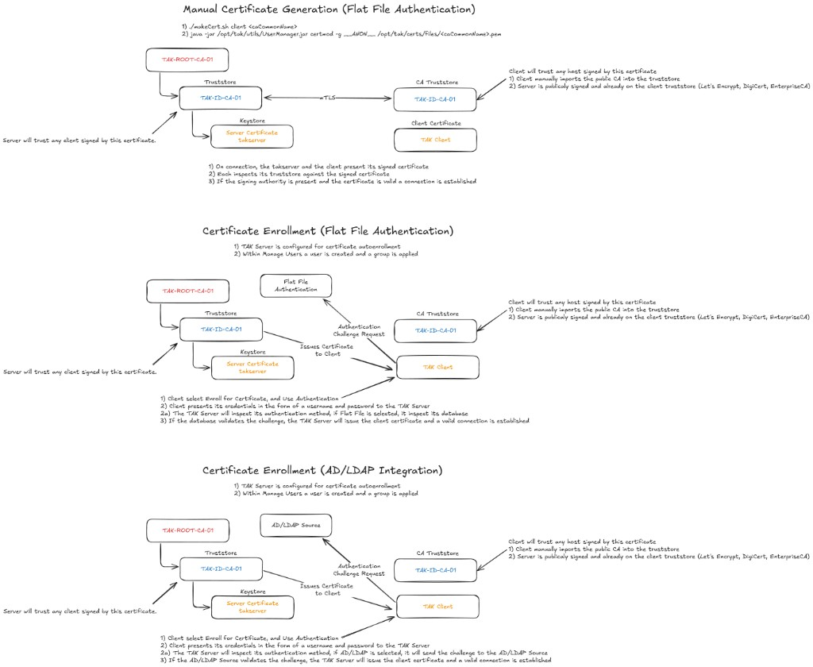

# infra-TAK Technical Handoff Document

---

## Prompt for a new chat (copy and paste this)

```
Read docs/HANDOFF-LDAP-AUTHENTIK.md — current release is v0.8.5-alpha.

CRITICAL INCIDENTS:
- v0.8.0: introduced AUTHENTIK_HOST internal-URL fix (correct for fresh installs) but the post-update migration unconditionally restarted the LDAP outpost, causing thundering herd (bind cache wipe → all clients re-auth simultaneously → worker/Postgres exhaustion) on active installs.
- v0.8.1: hotfix — LDAP migration now health-gated (checks websocket + no TLS error before patching/restart).
- v0.8.2: post-update migration auto-sets AUTHENTIK_WEB_WORKERS=4 and restarts server only (never ldap).
- v0.8.3: idle_in_transaction_session_timeout 120s → 30s with force-recreate to apply (10s was tried first and broke Authentik startup — migration lifecycle has idle gaps of 10-20s).
- v0.8.4: REVERSED the v0.8.0 routing migration for boxes whose outpost was spiraling on http://authentik-server-1:9000. Through Caddy (https://<fqdn> + extra_hosts:host-gateway), HTTP/2 multiplexing and connection pooling shape the request flow and prevent parallel unbounded queries from exposing Authentik 2026.2.2's slow policybindingmodel evaluation. Tak-10 dropped from 200+ active Postgres queries to 1 the moment routing was reversed.
- v0.8.5: HARDENING of v0.8.4. (a) PROACTIVE routing migration `_ensure_authentik_ldap_outpost_on_fqdn` — migrates boxes from internal direct routing to FQDN on Authentik deploy / TAK Server deploy / Update Now / every 10 min, gated on `/opt/tak` installed AND FQDN configured AND Caddy reachable. Catches the responder-class latent misroute that the reactive detector cannot see (cached SA session masks the spiral until first fresh bind). (b) Gunicorn worker timeout bump 30s→120s — `_ensure_authentik_gunicorn_timeout` appends `GUNICORN_CMD_ARGS=--timeout=120` to `~/authentik/.env` once and recreates only the server container. Closes the SIGABRT cascade observed on tak-10 (heavy LDAP load → Authentik 2026.2.2 flow planner exceeds 30s → gunicorn kills worker → in-flight TCP drops → Caddy 502 → outpost retry → stage recursion). Idempotent — never overwrites operator override; safe everywhere because timeout never fires on fast boxes. (c) Verifier hardening — `_test_ldap_bind_dn_verdict` returns tri-state `'ok' | 'fail' | 'inconclusive'`; `_ensure_authentik_webadmin` no longer does destructive DELETE+POST recreate on inconclusive verdicts and re-queries before POST on confirmed-fail (kills the responder `400 username must be unique` regression). (d) Dual-signal spiral detection with two-tier markers — outpost trips on ≥1 spiral-specific marker (`result code 50`, `nil pointer`, `exceeded stage recursion`, 502/503) OR Postgres idle-in-trans ≥30. General markers (`failed to execute flow`, `EOF`) tracked for forensics only — they appear on healthy boxes from typos and normal disconnects, false-positive trapped during tak-10 dev testing. (e) Periodic 10-min monitor thread (PID-locked, 6h rate limit) so spirals manifesting after Update Now self-heal. (f) Granular gate logging at every early-return. (g) Forensics persisted to settings.authentik_spiral_last_repair, settings.authentik_proactive_routing_migration, and settings.authentik_gunicorn_timeout_migration.

NEVER restart the LDAP outpost in a migration unless it is provably broken. NEVER use fewer than 4 Authentik web workers on an active install. NEVER set idle_in_transaction_session_timeout below 30s — Authentik startup will crash-loop. Caddy is a request shaper for the LDAP outpost — direct routing to authentik-server-1:9000 exposes the upstream Authentik 2026.2.2 LDAP-flow regression.

VALIDATED in field on 2026-04-29 across tak-10 (heavy DataSync/Node-RED), ssdnodes (medium streaming), and responder (medium-light): all three on v0.8.5-alpha, all three on FQDN routing, all three with GUNICORN_CMD_ARGS=--timeout=120, all three at SIGABRT=0 / outpost recursion=0 / Postgres idle-in-trans=0 over 30+ min of real bind load (1.5–2.4 binds/sec sustained per box). Spiral monitor heartbeating every 10 min on each box, hitting "outpost already on FQDN — skipping (already correct)" gate as expected. v0.8.5 is the stable baseline.

Bursty CPU on heavy-DataSync boxes is NORMAL, not a regression: tak-10 swings server CPU 100%+ → 7% → 1% over 60s windows because DataSync clients re-authenticate per HTTP request and Node-RED engine flows fire clock-aligned bind clusters. The `--timeout=120` gunicorn fix absorbs these bursts; SIGABRT count = 0 is the proof. Don't chase low CPU as a goal on Mission API / DataSync / Node-RED boxes.

See "April 2026 — v0.8.0 → v0.8.4 LDAP outpost routing reversal", "April 2026 — v0.8.5 hardening", and "April 2026 — v0.8.5 fleet validation" sections for full incident details and rules.
Use docs/HANDOFF-LDAP-AUTHENTIK.md as the single source of truth for what's done and what to do next.
```

---

## TAK Server Authentication Paths — Visual Reference

The diagram below (credit: mytecknet.com) shows the three certificate authentication paths in TAK Server side by side. Key takeaways for the infra-TAK / Authentik setup:

- **Manual cert generation (top):** `makeCert.sh` creates the cert; `certmod -g __ANON__` places the user in the flat file under the ANON group. Group can be changed with subsequent `certmod` calls.
- **Certificate enrollment — Flat File (middle):** Client presents username/password → TAK Server validates against `UserAuthenticationFile.xml` → issues cert. User was pre-created in Manage Users.
- **Certificate enrollment — AD/LDAP (bottom):** Client presents username/password → TAK Server sends the challenge to the AD/LDAP source (Authentik LDAP outpost in infra-TAK) → if validated, TAK Server issues the cert. The cert is always TAK Server-signed; Authentik handles identity validation in the middle of the flow. The user is **not** added to the flat file via this path.



---

## LDAP vs flat-file and `webadmin` (8446) — why infra-TAK strips one XML row

**What we abandoned:** Deleting or emptying `UserAuthenticationFile.xml` wholesale, or expecting it to stay gone — TAK Server can **rewrite** that file on restart, so that approach was brittle.

**What we validated in the field:** With **LDAP as the default auth** in `CoreConfig.xml` (`default="ldap"` and a proper `<ldap …/>` block toward Authentik), normal 8446 password auth goes through **LDAP**, not “mystery fallback” to flat-file for users who exist only in LDAP.

**Why `_remove_webadmin_from_userauth()` still exists (surgical, not global):** The painful bug was **duplicate identity**: the same username **`webadmin`** present in **both** `UserAuthenticationFile.xml` (e.g. from an old `UserManager.jar usermod`) **and** Authentik/LDAP. In that situation TAK can check the flat-file entry for `webadmin` and ignore the LDAP password you expect — wrong password / “shadowing” symptoms. See `docs/WORKFLOW-8446-WEBADMIN.md` for the table and flow.

**What the code does:** It does **not** remove the `<File …/>` provider from CoreConfig by default. It **only removes the `<user identifier="webadmin" …>` element** from `UserAuthenticationFile.xml` when Authentik is in use, after sync — minimal change so there is no second password store for that one account. Optional: TAK Server page **flat-file auth toggle** if you want to disable the File provider entirely.

**Complexity tradeoff:** Extra moving parts in exchange for a **narrow** fix (one user, one file) instead of fighting TAK’s file lifecycle or over-disabling flat-file for everyone.

---

## April 2026 — LDAP outpost thundering herd (v0.8.0 regression → v0.8.2 fix)

**Incident summary:** v0.8.0 introduced a correct fix (LDAP outpost `AUTHENTIK_HOST` pointed at `https://<fqdn>` instead of `http://authentik-server-1:9000`, causing `tls: internal error` on fresh installs). The fix was correct. The post-update migration was not: it patched the compose file and **restarted the LDAP outpost unconditionally on all existing installs**, including healthy ones.

**What restarting the LDAP outpost does:** The outpost's `bind_mode: cached` holds all active bind sessions in memory. A restart wipes every cached session. With active TAK clients, every client re-authenticates simultaneously. Each bind drives the full Authentik flow executor (3 HTTP round-trips + heavy Django ORM queries against Postgres). On a box with many clients, 50–100+ concurrent flow executor requests saturate Authentik's 2 default server workers, causing request queuing. Each worker processes one request at a time; requests queue and take 100–200 seconds each. The LDAP outpost has an HTTP timeout shorter than this queue depth, so it returns EOF. TAK Server retries the bind. The retry creates more concurrent requests. The system locks into a death spiral that does not self-resolve without intervention.

**Postgres symptom:** `max_connections` (default 300) is exhausted because each queued flow executor request holds a Postgres connection for its entire 100–200 second duration. Postgres logs show hundreds of `FATAL: terminating connection due to administrator command` or idle-session timeout kills.

**Recovery:**
1. Restart Authentik (`docker compose restart`) to kill all queued requests and Postgres connections.
2. Scale workers: add `AUTHENTIK_WEB_WORKERS=4` to `~/authentik/.env`, then `docker compose restart server` (NOT ldap — do not clear bind caches again).
3. Wait 3–5 minutes for runtimes to drop to under 1000ms. Caches rebuild automatically.

**v0.8.1 fix:** Migration made conditional — checks LDAP outpost websocket connection and TLS error state before patching. Skips entirely if outpost is healthy.

**v0.8.2 fix:** Post-update migration automatically sets `AUTHENTIK_WEB_WORKERS=4` if not already ≥ 4, then restarts only the server container. LDAP outpost is never touched. This runs on every Update Now and requires no operator action.

**Verified resolution:** Flow executor runtimes dropped from 200,000ms to under 7,000ms immediately after the server restarted with 4 workers.

**v0.8.3 fix:** Discovered a separate Postgres exhaustion vector: Authentik 2026.2.2's enterprise license check opens a DB transaction on every flow executor request and does not commit it cleanly, leaving `idle in transaction` connections that accumulate until the pool (max 300) is exhausted. On the dev box (tak-10) with 8 workers this produced 228 `idle in transaction` connections, Postgres at 500–800% CPU, and 4.6GB RAM usage. Reduced `idle_in_transaction_session_timeout` from `120s` to `30s` in the PostgreSQL command-line args in `docker-compose.yml`. The post-update migration (`_apply_authentik_pg_tuning`) now force-recreates the postgresql container when args change (required — command-line args need a full container recreate, not just a config reload). **Note:** 10s was tried first and caused a crash-loop: Authentik's migration lifecycle holds a transaction open for the full startup sequence (module loading has idle-in-transaction gaps of 10–20s), so any timeout below ~20s will kill the startup connection. 30s is the safe minimum.

### Rules established by this incident

- **NEVER restart the LDAP outpost in a post-update migration unless the outpost is provably broken.** Test: check `docker logs authentik-ldap-1 --tail=60` for `successfully connected websocket` (healthy) and absence of `remote error: tls: internal error`. If healthy, skip migration entirely.
- **NEVER restart `docker compose restart` (all services) to fix LDAP issues on a live box.** Restarting the LDAP outpost on a live active deployment causes a guaranteed thundering herd. Restart only `server` and `worker` if capacity is the issue. Only restart `ldap` if the outpost is provably broken (TLS error, not connected).
- **`AUTHENTIK_WEB_WORKERS` must be set to 4 or higher on any install with more than ~10 active TAK clients.** Default is 2 workers, which is insufficient to handle bind storms after any restart. The v0.8.2 migration sets this automatically on update.
- **The LDAP outpost bind cache is your most important performance asset.** A cached session costs zero Postgres queries. An uncached bind costs 3+ HTTP round-trips and multiple ORM queries. On a box with 50 active clients, losing the cache means 50 simultaneous full-cost flow executions hitting the server at once.
- **Post-update migrations that touch running containers must be gated by a health check.** The pattern: check health first → if healthy, skip → if broken, patch + restart. No exceptions.

---

## April 2026 — v0.8.0 → v0.8.4 LDAP outpost routing reversal (the real upstream story)

**Headline:** v0.8.0's URL change from `https://<fqdn>` (Caddy hop) to `http://authentik-server-1:9000` (direct Docker network) was the *only* meaningful infra-TAK change between v0.7.9 and v0.8.0. Operators who were running fine for months reported their boxes melting after the v0.8.0 update. Field operator (Amos's Samsung Azure VM) reported the same on v0.7.5, v0.8.0, and v0.8.2 — eliminating "infra-TAK version" as the variable. Comparing tak-10 (broken) and responder (healthy) showed identical Authentik configuration, identical roles, identical flow stage bindings, identical LDAP provider config — both on Authentik 2026.2.2.

**The actual variable:** **LDAP request volume crossing the spiral threshold.** Streaming-only Node-RED (responder) generates almost no LDAP traffic — one cert auth per long-lived TLS connection. Mission API / DataSync clients (tak-10) re-authenticate per HTTP request and produce continuous LDAP volume. With the v0.8.0 direct-internal routing, parallel unbounded HTTP/1.1 connections from the LDAP outpost slam Authentik's slow `policybindingmodel` flow evaluation simultaneously, exhaust Postgres `max_connections`, and the outpost panics on `EOF` from the choked server, wiping the bind cache and cascading into the spiral.

**The Caddy hop was acting as a pressure valve we didn't realize we needed.** HTTP/2 multiplexing serializes requests over a small number of connections; connection pooling caps the parallelism Authentik sees. The v0.8.0 fix removed it.

**Verified live on tak-10 (April 2026):**

| Metric | v0.8.0+ direct internal URL | v0.8.4 reversed via Caddy |
|---|---|---|
| Postgres `active` queries | 200+ on `policybindingmodel` | **1** |
| LDAP outpost errors / minute | hundreds (`Result Code 50` / nil pointer / EOF) | **0** |
| Authentik flow latency | 100–135 seconds | low (cache rebuilds) |

The change took effect within seconds of `docker compose up -d --no-deps --force-recreate ldap` with the new compose. The bind cache rebuilds naturally over the next minutes. Server `unhealthy` state lingered for a couple minutes while it digested the queued requests but resolved without intervention.

**v0.8.4 fix:** New post-update migration (`_apply_authentik_ldap_routing_repair`) detects the spiral and reverses the routing. Strict gates:

1. LDAP service must currently be on `http://authentik-server-1:9000` (skip otherwise — leaves boxes that were correctly on FQDN alone).
2. Outpost log must show ≥2 spiral markers (`Result Code 50`, `nil pointer`, `failed to execute flow`, `EOF`, `502`, `503`, `exceeded stage recursion depth`). Healthy outposts skip.
3. `https://<fqdn>/-/health/live/` must respond from inside the LDAP container (probe via `docker exec wget`). If Caddy isn't ready or the FQDN doesn't resolve, skip — don't migrate boxes onto a broken FQDN path.
4. After rewriting compose and recreating LDAP, validate within 30s: outpost must show `successfully connected websocket` and no `tls:` / `502` / `503` errors. On failure, restore backup and recreate LDAP back on internal URL.

The v0.8.0+ migration that enforces internal URL is preserved for genuine `tls: internal error` cases (fresh installs where Caddy isn't ready). The two migrations are mutually exclusive by design: v0.8.0+ fires only when on FQDN and broken, v0.8.4 fires only when on internal and broken. Healthy boxes skip both.

**The upstream Authentik 2026.2.2 regression itself is not fixed by infra-TAK.** Per Amos's data, `policybindingmodel` evaluation jumped from sub-second (older Authentik) to 100+ seconds (2026.2.2). We're working around it by keeping Caddy in the path. Once Authentik ships a fix in 2026.3+, this workaround can stay (it's not harmful) or be revisited.

### Rules added by this incident

- **Caddy is a required hop for the LDAP outpost on busy installs.** Direct internal routing (`http://authentik-server-1:9000`) only works on light-load installs and fresh installs without Caddy. Active installs with Mission API / DataSync clients must route through `https://<fqdn>` for request shaping.
- **Spiral signature in LDAP outpost logs = "provably broken"** for the cardinal-rule purposes. The HANDOFF gate says don't restart LDAP unless provably broken; finding ≥2 of [`Result Code 50`, `nil pointer`, `EOF`, `503`, `502`, recursion depth] in `--tail 200` qualifies.
- **Routing migrations must validate before committing.** Any compose change that targets the LDAP service must (a) backup, (b) recreate, (c) validate within 30s, (d) auto-rollback on failure. The new function follows this pattern; future migrations should as well.
- **`idle_in_transaction_session_timeout` detection must be value-agnostic.** v0.8.4 generalized `needs_pg_update` to catch any value other than `30s` (was previously hardcoded list of `300s/10s/120s`, missing operator manual values like `15s`).
- **The `AUTHENTIK_HOST=https://<fqdn>` value in `~/authentik/.env` is the canonical FQDN source of truth.** Other env vars (`AUTHENTIK_COOKIE_DOMAIN`) derive from it. Migrations that need the FQDN should read it from there, not from settings or Caddyfile.

---

## April 2026 — v0.8.5 hardening: dual-signal detection + periodic monitor

**Why v0.8.5 was needed.** Field testing of v0.8.4 on `tak-10`, `responder`, and `ssdnodes` exposed two real-world failure modes in the v0.8.4 routing-repair migration:

1. **Detection blind spot from high bind volume.** v0.8.4 sampled `docker logs authentik-ldap-1 --tail 200` for ≥2 spiral markers. On busy boxes (Mission API / DataSync / many CoT clients), normal `Bind request` lines accumulate at thousands per minute and push the spiral markers off the visible 200-line window. On `ssdnodes` during testing, full-log `bash grep` showed 14 spiral markers; the v0.8.4 sample showed 0 → migration logged "0/2 markers — leaving alone" while the box was actively spiraling.
2. **One-shot timing.** The migration only runs once, immediately after Update Now. A spiral that manifests 30 minutes later (after traffic ramps, after a clock-aligned Mission API poll, after a Caddy bounce) gets no second chance — the operator has to notice the CPU spike and re-run Update Now. The v0.8.4 promise of "easy update no hit this or that" silently breaks.

**v0.8.5 fix #1 — dual-signal detection with two-tier markers (`_detect_authentik_ldap_spiral`):**

The repair function now confirms the spiral via **either** signal:

| Signal | Threshold | Why it works |
|---|---|---|
| LDAP outpost log — **spiral-specific** markers (`result code 50`, `nil pointer`, `exceeded stage recursion`, `502 bad gateway`, `503 service unavailable`) | ≥**1** in last 1000 lines | Faster check; catches early-stage spirals before Postgres congestion. These markers do NOT appear on healthy boxes |
| LDAP outpost log — **general** markers (`failed to execute flow`, `EOF`) | tracked, never trip alone | These appear on every healthy box (user typo → `failed to execute flow`; normal LDAP client disconnect → `EOF`). Recorded for forensics only |
| Postgres `idle in transaction` from `application_name LIKE '%authentik%'` | **≥30** | Durable signal — survives LDAP container recreates (which wipe outpost log) and can't be drowned out by high bind volume. Healthy boxes sit at 0–3; spiraling boxes at 50–200+ |

The Postgres signal is the breakthrough: it's the same metric Amos's report (Samsung Azure VM) used to identify the spiral originally, and the same metric we used to confirm the fix worked on `tak-10` (200+ → 1 idle-in-trans within seconds of routing reversal).

**Why the two-tier marker design (v0.8.5 dev testing on tak-10):** Initial v0.8.5 used "≥2 unique markers" as the outpost signal (treating all 7 markers equally). Field testing on a healthy tak-10 immediately after the v0.8.5 update tripped the detector with 2 unique markers (transient `failed to execute flow` + `EOF` from the LDAP container restart cycle) even though `idle-in-trans=0` and the box was perfectly healthy. The repair gate caught it ("already on FQDN — skipping") so no harm done, but the threshold was clearly wrong. The two-tier split eliminates restart-artifact false positives while still catching real spirals within seconds — `nil pointer` / `exceeded stage recursion` / `result code 50` / 502/503 simply do not appear on healthy boxes.

**v0.8.5 fix #2 — periodic monitor (`_authentik_spiral_monitor`):**

A daemon thread inside the console runs every 10 minutes, calls the dual-signal detector, and if a spiral is confirmed, runs the same idempotent `_apply_authentik_ldap_routing_repair` function. Same gates, same Caddy probe, same auto-rollback. Fully automatic; no operator action.

Safeguards:
- **Single-instance lock** (`/tmp/takwerx-spiral-monitor.lock`, PID-checked) — gunicorn runs N workers; only one runs the monitor. Steals the lock if the holder PID is dead so restarts always have a live monitor.
- **Repair rate limit**: max 1 repair attempt per 6 hours (recorded in `settings.json` under `authentik_spiral_last_repair`). Prevents thrashing on pathological boxes (spiral confirmed but Caddy unreachable — repair would skip every 10 min anyway, but cap the noise).
- **No-op on healthy boxes** — most boxes will see the monitor wake every 10 min, find nothing, sleep again. One log line at startup, then silent.

**v0.8.5 fix #3 — granular gate logging.** Every early-return in the routing repair now logs *why* it skipped, all under the `routing repair: ...` prefix so operators can grep one stream. The diagnostic gap that hid the `ssdnodes` issue (logged "0/2 markers" without saying which 0/2 it sampled or how big the window was) is now closed.

**v0.8.5 fix #4 — spiral repair forensics in `settings.json`.** Every repair attempt persists `{ts, outcome, evidence, outpost_markers}` under `authentik_spiral_last_repair`. Used for the rate limit; also useful when an operator reports "I think it spiraled and recovered last night" — the timestamp + evidence is right there.

**v0.8.5 fix #5 (added during responder field test) — PROACTIVE routing migration (`_ensure_authentik_ldap_outpost_on_fqdn`).** Field-testing on `responder` exposed a case the reactive detector cannot catch: a TAK-installed box on internal direct routing (`http://authentik-server-1:9000`) where the cached `adm_ldapservice` session was masking all outpost failures. There was no spiral signature in the outpost log because the only client successfully binding was the cached SA. The bug was invisible until `webadmin` (no cache) attempted a fresh bind, which immediately recursed and threw "exceeded stage recursion depth". By the time the operator hit "Resync LDAP" the box was already broken; reactive detection was correctly NOT firing, but the box was one fresh-bind away from spiraling.

The proactive function migrates the LDAP outpost to FQDN routing **without waiting for a spiral**, gated only on the box's load profile:

| Precondition | Why |
|---|---|
| `~/authentik/docker-compose.yml` + `.env` exist | Authentik installed |
| Outpost is currently on `http://authentik-server-1:9000` | Migration target is internal direct routing |
| `.env` has `AUTHENTIK_HOST=https://<fqdn>` | FQDN configured (no migration target otherwise) |
| `https://<fqdn>/-/health/live/` reachable from inside the LDAP container | Caddy is up; if down we'd brick the box |
| `/opt/tak` exists | TAK Server installed = heavy LDAP load profile that exposes the bug |

When ALL hold: backup compose → rewrite to FQDN + `extra_hosts:host-gateway` → `docker compose up -d --no-deps --force-recreate ldap` → 30s validation → restore on failure. Idempotent — no-op on FQDN-routed boxes, on light-load boxes (no `/opt/tak`), on Caddy-not-ready boxes.

**Triggers:**
1. Authentik deploy / reconfigure completion
2. TAK Server deploy completion (catches the Authentik-then-TAK install order)
3. Post-update migration after every Update Now
4. Periodic spiral monitor (every 10 min, runs the proactive pass before the reactive pass)

The reactive `_apply_authentik_ldap_routing_repair` still runs second as a fallback for boxes where the proactive preconditions weren't met (e.g. Caddy temporarily down) but the box has already started spiraling.

**v0.8.5 fix #6 (added during tak-10 dev testing) — gunicorn worker timeout 30s → 120s (`_ensure_authentik_gunicorn_timeout`).** With FQDN routing already correct on tak-10 (≈3.5 LDAP binds/sec sustained, 1000+ in 5 min), Caddy logs still showed periodic upstream `EOF` (translated to 502) at 70-90 ms request lifetimes, and outpost logs still showed brief `exceeded stage recursion depth` bursts. Authentik server logs explained why: `[CRITICAL] WORKER TIMEOUT (pid:N) → [ERROR] Worker (pid:N) was sent SIGABRT! → [INFO] Booting worker with pid:N+1`. Authentik 2026.2.2's flow planner under heavy LDAP-bind load occasionally exceeds gunicorn's upstream default 30s worker timeout (we observed flow plans completing in 124-136 s with status 200). Gunicorn assumes a worker silent for >30s is hung, SIGABRTs it, drops every in-flight TCP connection in that worker mid-response. Caddy sees connection-reset, returns 502 to the LDAP outpost. The outpost retries; the retry hits "exceeded stage recursion depth" inside the same flow.

The fix is the smallest possible change: append `GUNICORN_CMD_ARGS=--timeout=120` to `~/authentik/.env` and recreate only the server container (`docker compose up -d --no-deps --force-recreate server`). Worker / postgresql / redis / ldap untouched. Validated post-restart via `docker exec authentik-server-1 printenv GUNICORN_CMD_ARGS`. Outcome persisted to `settings.json` under `authentik_gunicorn_timeout_migration`.

Why 120 s: 124-136 s slow plans complete with status 200 under 120 s with margin; the 200 s+ outliers are queued requests waiting for an unblocked worker, not a single 200 s request. 120 s catches the slow-plan case without leaving workers hung indefinitely on a genuinely-stuck request.

Why this is safe to ship to all boxes (not gated on load profile like the routing migration): the timeout never fires on healthy/fast boxes (typical request 50-200 ms), so behavior is unchanged. On heavy-load boxes it absorbs slow plans without dropping connections. Idempotent — never overwrites an existing `GUNICORN_CMD_ARGS` (operator override / future Authentik defaults survive).

**Triggers:** Authentik deploy completion, TAK Server deploy completion, post-update migration. **Deliberately NOT** hooked into the periodic spiral monitor — this is one-shot config, not a hot fix to re-apply. If the operator manually unsets the env var, the periodic monitor must not re-set it.

**v0.8.5 fix #7 (added during responder field test) — verifier hardening (`_test_ldap_bind_dn_verdict`).** The responder operator hit `WebAdmin: Authentik API 400: {"username":["This field must be unique."]}` on every Resync LDAP. Root cause: `_test_ldap_bind_dn` returned `False` when ldapsearch was missing on the host AND the outpost log showed `exceeded stage recursion depth` (the spiral signature, not a credential failure). Caller `_ensure_authentik_webadmin` interpreted this as "bind confirmed-failed, recreate webadmin" and ran DELETE+POST. The DELETE silently failed (race / async), the POST returned 400. Repeat forever.

The fix:
- `_test_ldap_bind_dn_verdict` returns tri-state `'ok' | 'fail' | 'inconclusive'`. Inconclusive = ldapsearch unavailable AND/OR outpost log shows recursion/EOF/nil-pointer (spiral signature, not credential failure).
- `_test_ldap_bind_dn` is preserved as a backward-compatible wrapper (returns True only on `'ok'`); read-only callers don't change.
- `_ensure_authentik_webadmin` now: on `'ok'` → success; on `'inconclusive'` → return success WITHOUT destructive recovery, but kick off `_ensure_authentik_ldap_outpost_on_fqdn` (the inconclusive verdict often *is* the responder spiral); on `'fail'` → DELETE, then **re-query** to confirm the user is gone before POST. If the DELETE didn't take, skip the recreate and surface a clear error instead of triggering the 400.
- `_test_ldap_bind_dn_verdict` calls `_ensure_ldapsearch()` once at the top — so the inconclusive case is rare on Debian/RHEL hosts.

### Operator-visible diagnostics

```bash
# Postgres spiral signal — should be 0–3 on healthy boxes, ≥30 means spiraling
docker exec authentik-postgresql-1 psql -U authentik -d authentik -tAc \
  "SELECT count(*) FROM pg_stat_activity WHERE state='idle in transaction' AND application_name LIKE '%authentik%';"

# Last reactive spiral repair attempt (if any)
jq '.authentik_spiral_last_repair // "no spiral repair attempts recorded"' /opt/takwerx/settings.json 2>/dev/null \
  || jq '.authentik_spiral_last_repair // "no spiral repair attempts recorded"' ~/.config/settings.json

# Last proactive routing migration (if any)
jq '.authentik_proactive_routing_migration // "no proactive migration recorded"' /opt/takwerx/settings.json 2>/dev/null \
  || jq '.authentik_proactive_routing_migration // "no proactive migration recorded"' ~/.config/settings.json

# Last gunicorn timeout migration (if any) — should show value=120 once applied
jq '.authentik_gunicorn_timeout_migration // "no gunicorn timeout migration recorded"' /opt/takwerx/settings.json 2>/dev/null \
  || jq '.authentik_gunicorn_timeout_migration // "no gunicorn timeout migration recorded"' ~/.config/settings.json

# Current LDAP outpost routing — should be FQDN on TAK-installed boxes, internal on console-only
grep -A0 'AUTHENTIK_HOST:' ~/authentik/docker-compose.yml | head -5

# Current gunicorn worker timeout — should be 120 on all v0.8.5+ boxes with Authentik
docker exec authentik-server-1 printenv GUNICORN_CMD_ARGS
# → --timeout=120 (or empty if migration hasn't run yet — re-trigger via Update Now or Authentik deploy)

# Worker SIGABRT cascade — should be 0 on a v0.8.5 box that previously hit it
docker logs authentik-server-1 --since 1h 2>&1 | grep -cE "WORKER TIMEOUT|SIGABRT"

# Monitor + migration activity (one line at startup, then silent on healthy boxes)
sudo journalctl -u takwerx-console --since "1 hour ago" | grep -E "spiral monitor|routing repair|proactive routing|gunicorn timeout"
```

### Rules added by v0.8.5

- **Two-signal detection beats one-signal detection for spiral diagnosis.** Outpost log is fast but maskable; Postgres idle-in-trans is durable and unmaskable. Use both. (Generalizes to any future Authentik failure mode that produces a Postgres state signature.)
- **One-shot post-update migrations are insufficient for self-healing.** Anything that fixes a runtime drift (spiral, cache wipe, Caddy bounce, network blip) must run on a periodic schedule, not just at update time. The operator promise is "the update fixes it"; that means the update fixes it the first time *and* keeps fixing it as conditions change.
- **Background threads in gunicorn must hold a single-instance PID-checked lock.** N workers means N copies of every module-load thread. Without a lock, monitors thrash; with a stale lock, restarts have no monitor. The `os.kill(pid, 0)` pattern (used by `_post_update_auto_deploy` and the spiral monitor) is the standard.
- **Every gate-skip in a migration must log why.** Silent skips hide bugs (the `ssdnodes` `0/2 markers` case). The `routing repair: <reason> — skipping (<context>)` format is the standard.
- **Reactive detection is necessary but not sufficient — proactive precondition migrations come first.** Some bugs are silently latent (responder's misroute hidden by the cached SA session) and never produce a reactive signal until the operator's first fresh bind, which is also the first failed bind they see. Configurations that are known to fail under heavy load (`/opt/tak` installed) must be migrated proactively when preconditions are safe — don't wait for proof of failure.
- **Probe verdicts must be tri-state when the negative result feeds destructive recovery.** Boolean `True/False` conflates "confirmed failure" with "couldn't determine", which is fine for read-only display but a critical bug for any DELETE+POST recreate path. Use `'ok' | 'fail' | 'inconclusive'` and gate destructive paths on confirmed-fail only. (See `_test_ldap_bind_dn_verdict`.)
- **DELETE before POST must re-query before POSTing.** If your recovery path deletes a uniquely-keyed record and then creates a fresh one, the DELETE can race or silently fail. Always re-query for the unique key after DELETE; if the record still exists, do not POST a duplicate (Authentik API returns `400 username must be unique`). Skip and surface the error.
- **Don't change passwords if the error is about stages.** "exceeded stage recursion depth" / `LDAP Result Code 50` / `nil pointer dereference` / `EOF` are flow-execution errors. They don't mean the password is wrong, they mean the flow itself can't run. Recreating users or resetting passwords does not help — fix the routing, the cache, or the flow planner instead.
- **`authentication: none` on the LDAP `ldap-authentication-flow` is required.** Setting it to anything else makes the flow planner refuse to issue a plan to anonymous bind requests. Don't change.
- **Don't put `password_stage` on the identification stage AND a `password` stage in the flow** — that causes recursion. The identification stage's `password_stage` field should be cleared; let the password stage binding in the flow do the work.
- **Don't set `configure_flow` on the password stage.** That redirects the flow into a password-change subflow, which recurses.
- **`bind_mode: cached` hides issues.** Healthy boxes can sit on a stale cached SA bind for hours while every fresh bind fails. Test with a non-cached client periodically (or just check `/api/v3/outposts/instances/<pk>/health/`).
- **The LDAP outpost gets `bind_flow_slug` from the provider's `authorization_flow` — not `authentication_flow`.** Setting the latter does nothing for LDAP binds.
- **The cardinal "never restart LDAP unless it's provably broken" rule has two qualifying conditions now (v0.8.5):** (1) reactive — spiral signature in outpost log OR ≥30 idle-in-trans; (2) proactive — outpost on internal direct routing AND `/opt/tak` exists AND FQDN configured AND Caddy reachable. Both qualify; everything else is hands-off.
- **NEVER restart Authentik with the upstream-default 30s gunicorn timeout on heavy-LDAP-load boxes.** Authentik 2026.2.2's flow planner exceeds 30s under sustained 3+ binds/sec, gunicorn SIGABRTs the worker, in-flight connections drop, Caddy returns 502, outpost retries, recursion. The `_ensure_authentik_gunicorn_timeout` migration sets `--timeout=120` automatically; never lower it below 90s. Operator override of `GUNICORN_CMD_ARGS` is allowed (the migration won't overwrite) but values <90s on a TAK-installed box are a known regression.
- **Server-only restart is safe; full-stack restart is not.** When applying any Authentik server config change (workers, gunicorn timeout, env vars), use `docker compose up -d --no-deps --force-recreate server` — never `docker compose restart` (which restarts ldap and clears bind caches). The server-only path takes ~10-30s of API unavailability with cached LDAP service-account sessions surviving; the full-stack path triggers the v0.8.0 thundering herd.
- **One-shot config migrations must not be wired into periodic monitors.** Things like `_ensure_authentik_gunicorn_timeout` apply once and then hand control to the operator. If a monitor re-applies them every 10 min, an operator override can never stick. Routing repairs are different — they're hot fixes for runtime drift and should re-run as needed.

---

## April 2026 — v0.8.5 fleet validation (post-release verification)

**Date:** 2026-04-29 (within hours of v0.8.5-alpha tag on main).

**Three-box matrix.** Validation snapshot taken after Update Now on all three production boxes (responder + ssdnodes via Update Now; tak-10 via the dev-branch one-shot Python invocation that pre-dated the tag).

| Metric | tak-10 | ssdnodes | responder |
|---|---|---|---|
| infra-TAK version | 0.8.5-alpha | 0.8.5-alpha | 0.8.5-alpha |
| LDAP routing | `https://tak.test12.taktical.net` | `https://tak.test8.taktical.net` | `https://tak.test6.takwerx.com` |
| Gunicorn timeout | `--timeout=120` | `--timeout=120` | `--timeout=120` |
| Postgres idle-in-trans | 0 | 0 | 0 |
| Server SIGABRT (last 30 min) | 0 | 0 | 0 |
| Outpost recursion / 502 / nil-pointer (last 30 min) | 0 | 0 | 0 |
| Bind volume (last 5 min) | 706 (~2.4/sec) | 464 (~1.5/sec) | 473 (~1.6/sec) |
| Server CPU (1s snapshot) | 104% (burst) → 7% → 1% over 60s | 10% | 1.8% |
| Postgres CPU (1s snapshot) | 51% (burst) → 2% → 0.3% over 60s | 1.9% | 0.2% |
| Server mem | 575 MiB stable | 401 MiB | 692 MiB |
| Spiral monitor cadence | every 10 min, "already on FQDN — skipping" | every 10 min, same | every 10 min, same |
| `authentik_gunicorn_timeout_migration` | success @ ts 1777481628 | success @ ts 1777485606 | success @ ts 1777485595 |
| `authentik_proactive_routing_migration` | (not recorded — already on FQDN) | (not recorded — already on FQDN) | (not recorded — already on FQDN) |
| `authentik_spiral_last_repair` | (not recorded — never spiraled) | (not recorded — never spiraled) | (not recorded — never spiraled) |

**Interpretation rules established by this validation:**

- **`*_migration: (not recorded)` is a SUCCESS signal, not a gap.** The migration functions only persist a `success` record on an *actual* migration. When the box is already in the desired state (FQDN routing already configured, GUNICORN_CMD_ARGS already set), the function hits its idempotent skip gate and returns without writing. Reading "not recorded" on a healthy box means "no work needed at this trigger" — confirmed via the per-tick `[spiral monitor] proactive routing: outpost already on FQDN — skipping (already correct)` journalctl line. (The `gunicorn_timeout_migration` IS recorded on all three because all three crossed the gate from "no env var" → "env var added" exactly once. The `proactive_routing_migration` is NOT recorded on any of them because all three were on FQDN before v0.8.5 even shipped — tak-10 from earlier-version routing, responder from the manual fix, ssdnodes from always being correct.)

- **Update Now triggers the migrations within seconds.** ssdnodes and responder fired their gunicorn timeout migrations 11 seconds apart (`1777485595` vs `1777485606`), matching the user clicking Update Now on both boxes back-to-back. The post-update migration block correctly runs the new `_ensure_authentik_gunicorn_timeout` after the proactive routing function, even though the routing function found "already correct" and short-circuited.

- **Bursty CPU on heavy-DataSync boxes is the EXPECTED healthy steady state**, not a regression. tak-10's server CPU swung 104% → 17% → 7% → 1% over 90 s; postgres swung 51% → 33% → 2% → 0.3%. Memory locked at 575 MiB (no leak). PIDs locked at 39 (no worker thrashing). Block I/O frozen at 283 MB write (no disk pressure). The pattern is: idle ... idle ... clock-aligned DataSync poll + ArcGIS engine refresh + Mission API client fires → cluster of 50+ binds in 1-2 sec → Authentik flow planner crunches → server CPU spikes → drops. With `--timeout=120` the bursts complete cleanly; without it they would have been the SIGABRT cascade we just fixed. **Cardinal rule: do NOT chase low CPU on Mission API / DataSync / Node-RED boxes. Burst-and-idle is the design target. The metric that matters is SIGABRT count over 30+ min — that should be 0.**

- **Spiral monitor "already correct — skipping" tick every 10 min is the healthy fleet signature.** Each box shows exactly one heartbeat per 10 min from a single PID (single-instance lock holding). If you see two PIDs on one box's `[spiral monitor]` lines, the lock is broken (file a bug). If you see no heartbeats for >15 min, the monitor died (also a bug). Six consecutive `already on FQDN` ticks across an hour is the steady state.

**Field test artifacts:** the diagnostic block `infra-TAK v0.8.5 cross-box metric snapshot` (in agent-transcripts) captures all the queries used. Re-run on any box to validate the same matrix.

---

## Fresh-deploy expectations (Azure / new boxes)

For deploying v0.8.5-alpha onto a brand-new VPS (Azure, ssdnodes, etc.) the migrations fire automatically at the right points. Operator never has to call them manually.

**Recommended deploy order (matches what the migrations are gated on):**

1. **Caddy first** — set FQDN, save Domains. This makes `https://<fqdn>/-/health/live/` reachable later, which is precondition #4 for the proactive routing migration.
2. **Authentik** — `Authentik → Deploy`. At deploy completion, two migrations fire:
   - `_ensure_authentik_ldap_outpost_on_fqdn` — checks if `/opt/tak` exists; if NOT (likely on a fresh box at this point), logs "TAK Server not installed — leaving outpost on internal routing (light-load profile)" and exits. Internal routing is fine for console-only / pre-TAK boxes.
   - `_ensure_authentik_gunicorn_timeout` — fires unconditionally (it's safe everywhere). Adds `GUNICORN_CMD_ARGS=--timeout=120` to `~/authentik/.env`, recreates the server container only.
3. **TAK Server** — `TAK Server → Deploy`. At deploy completion, the SAME two migrations re-fire:
   - `_ensure_authentik_ldap_outpost_on_fqdn` — now `/opt/tak` exists, all 5 preconditions are met → migrates outpost to FQDN routing. This is the canonical path on a fresh deploy.
   - `_ensure_authentik_gunicorn_timeout` — already set from step 2, so no-op skip ("GUNICORN_CMD_ARGS already set in .env — skipping (idempotent)"). One log line.
4. **Spiral monitor** starts at console boot via the module-load thread. Heartbeats every 10 min, runs proactive routing pass first, reactive spiral pass second. On a fresh healthy box it sits silently except for the heartbeat.

**Post-deploy verification block (run once after step 3):**

```bash
# 1. Version
grep '^VERSION' ~/infra-TAK/app.py

# 2. Routing — should be FQDN
grep AUTHENTIK_HOST ~/authentik/docker-compose.yml | grep -A0 ldap -B0
# Expected: AUTHENTIK_HOST: https://<your-fqdn>

# 3. Gunicorn timeout — should be 120
docker exec authentik-server-1 printenv GUNICORN_CMD_ARGS
# Expected: --timeout=120

# 4. Health signals — all zero
docker exec authentik-postgresql-1 psql -U authentik -d authentik -tAc \
  "SELECT count(*) FROM pg_stat_activity WHERE state='idle in transaction' AND application_name LIKE '%authentik%';"
docker logs authentik-server-1 --since 10m 2>&1 | grep -cE "WORKER TIMEOUT|SIGABRT"
docker logs authentik-ldap-1 --since 10m 2>&1 | grep -cE "exceeded stage recursion|502 bad gateway|nil pointer"

# 5. Migrations recorded
python3 -c "
import json
s = json.load(open('/root/infra-TAK/.config/settings.json'))
for k in ['authentik_proactive_routing_migration', 'authentik_gunicorn_timeout_migration']:
    print(f'{k}: {s.get(k) or \"(not recorded)\"}')"
# Expected on a fresh TAK-installed deploy:
#   authentik_proactive_routing_migration: { ts, outcome:success, fqdn:<fqdn> }   ← recorded once on TAK Server deploy completion
#   authentik_gunicorn_timeout_migration:  { ts, outcome:success, value:120 }     ← recorded once on Authentik deploy completion

# 6. Spiral monitor alive
sudo journalctl -u takwerx-console --since "15 min ago" | grep "spiral monitor"
# Expected: at least one "[spiral monitor] PID <N> acquired monitor lock — starting" line
```

**Azure-specific notes:**

- Azure VMs sometimes hit DNS propagation delays for new FQDNs. The proactive routing migration probes `https://<fqdn>/-/health/live/` from inside the LDAP container; if Caddy hasn't finished fetching its LE cert OR DNS isn't fully propagated, the probe fails and the migration logs "cannot reach https://<fqdn> from LDAP container — skipping (Caddy/DNS not ready; retry later)" and exits cleanly. The spiral monitor will retry every 10 min until preconditions are met. **No manual action needed; just wait for the next monitor tick after DNS+Caddy are confirmed working.**
- Azure NSG / firewall must allow inbound 443 (Caddy LE), 8089 (TAK Server CoT TLS), 8443 (TAK Portal HTTPS), 8446 (TAK Server cert enrollment), 5001 (infra-TAK console — restrict to your IP), 389/636 (LDAP outpost — restrict to localhost / TAK-Server-only).
- If you provisioned the VM with a small instance type, watch memory: Authentik server is ~700 MiB after warm-up, postgres ~200 MiB, LDAP outpost ~15 MiB, plus the rest of the stack. Below 4 GB total RAM, you may OOM under bind storms. 8 GB is comfortable, 16+ GB is generous.

---

## April 2026 — Update Now, Git recovery, TAK Portal TLS (v0.4.0 → v0.4.2)

**Structured digest (tables + checklist):** [OPERATOR-FINDINGS-2026-04-UpdateNow-Portal-TLS.md](OPERATOR-FINDINGS-2026-04-UpdateNow-Portal-TLS.md)  
**Customer-facing release + skip-upgrade notes:** [RELEASE-v0.4.2-alpha.md](RELEASE-v0.4.2-alpha.md)  
**SSH recovery (canonical repo, not stale `origin`):** [README — Universal recovery (SSH)](../README.md#universal-recovery-ssh)

### Update Now / `git` (v0.4.0, v0.4.1)

- **Symptom:** **`would clobber existing tag`** on **Update Now**; sometimes unwanted ref updates alongside tag fetch.
- **Cause (part 1):** Old path used **`git fetch --tags`** (or equivalent bulk tag sync). Local tags that didn’t match GitHub caused hard failure.
- **Fix v0.4.0:** Resolve latest tag from **GitHub API**, fetch **only** `+refs/tags/<tag>:refs/tags/<tag>`.
- **Cause (part 2):** Git still applies **`remote.origin.fetch`** together with explicit refspecs → extra refs/tags could still move → clobber could persist.
- **Fix v0.4.1:** Run those fetches with **`git -c remote.origin.fetch=`** so only the intended refspec runs (main fallback uses the same isolation).
- **README / field recovery:** **`git fetch origin main`** is unsafe if **`origin`** points at a **fork** or wrong URL — **`origin/main`** stays ancient. Recovery must use **`https://github.com/takwerx/infra-TAK.git`** (see README one-liner).
- **Process:** **[TESTING-UPDATES.md](TESTING-UPDATES.md)** before pushing a **tag** (tag drives “Update Available”).

### TAK Portal `TAK_URL` — IP vs FQDN (v0.4.2)

- **Symptom:** Portal **not “connected”** to TAK; **QR / enrollment** → **identity could not be verified**; **`TAK_URL`** showed **VPS IP** instead of **`takserver.<fqdn>`**.
- **Cause:** **`_takportal_build_settings_dict()`** preferred **`server_ip`** for Docker→host reachability, but TAK’s cert is for a **hostname**. Node TLS hostname verification fails on **`https://<ip>:8443/Marti`**.
- **Fix v0.4.2:** When **`fqdn`** is set, prefer **`_get_takserver_host()`** for the `TAK_URL` host; IP fallback for no-domain installs.
- **Operator action:** After upgrading the console, **TAK Portal → Update config** (🔄) **required** — the container’s **`settings.json`** does not update by itself. Fresh portal **deploy** already runs the builder. Optional: **Sync TAK Server CA**.
- **Slack TL;DR:** Upgrade to **v0.4.2** → **Authentik Update config** once → **TAK Portal Update config** once → **Resync LDAP** if 8446 odd. IN/OUT group UI oddities may clear when Portal↔TAK is healthy (collateral, not a separate marketed fix).

### Authentik (unchanged track, still required for big jumps)

- v0.3.9+ behavior remains: **Update config** clears Postgres tuning drift, LDAP/webadmin/8446 hardening, etc. See **RELEASE-v0.4.2** for the skip-upgrade summary.

### TAK Server port 8089 — scary red `ERROR` lines

- **Symptom:** **`NotSslRecordException`**, **`PEER_DID_NOT_RETURN_A_CERTIFICATE`**, random **remote IPs** on **local port 8089**.
- **Cause:** **Public CoT/TLS** port; **internet scanners** send non-TLS or wrong TLS. Normal noise.
- **Impact:** Usually **none**; real clients show **INFO** subscriptions. Worry only about **disk** (unbounded logs) or **DDoS** scale.

### Guard Dog — `8089 unhealthy` restarts every ~15–20 min

- **Symptom:** **`restarts.log`** → **`restart | 8089 unhealthy`** on a timer; TAK keeps restarting though clients sometimes work.
- **Cause:** Old **`tak-8089-watch.sh`** treated a **slightly full** TCP accept queue as failure (**`Recv-Q >= Send-Q-5`**). Scanner traffic on public **8089** fills the queue partway → **false positive** → restart → grace period → repeat.
- **Fix:** Updated script uses **≥95%** queue saturation and **5** failures; **↻ Update Guard Dog** to install the new script. See **OPERATOR-FINDINGS** §8089 / **GUARDDOG.md**.

### Version line (for handoff search)

| Tag | What |
|-----|------|
| **v0.4.0** | API latest tag; single-tag fetch (partial clobber fix). |
| **v0.4.1** | `remote.origin.fetch=` isolation (clobber fix complete). |
| **v0.4.2** | TAK Portal `TAK_URL` FQDN; release notes + operator digest. |
| **v0.4.3** | Guard Dog **8089**, **Authentik** probe + retry, **Auto-VACUUM** logging; **↻ Update Guard Dog** after console upgrade. |
| **v0.4.4** | Guard Dog **8089** TCP connect probe replaces queue-depth (stops restart loops); **↻ Update Guard Dog** after console upgrade. |
| **v0.7.3** | `ldap-authentication-login` `session_duration=seconds=120` — password propagation fix. |

---

## April 2026 — LDAP Cached Bind / Password Propagation (v0.7.3)

### Problem

Users who reset their password via TAK Portal could not log in with the new password for up to 24 hours. Old credentials continued to authenticate on iTAK/ATAK during that window.

### Root Cause

Authentik's LDAP outpost runs `bind_mode: cached`. When a user successfully authenticates, Authentik creates a session and caches the successful bind result for the lifetime of that session. Future bind attempts for the same user are served from cache without re-validating against the user store.

TAK Portal resets passwords by calling Authentik's `POST /api/v3/core/users/{id}/set_password/` directly. This updates the stored credential but **does not invalidate existing sessions or cached binds**. The LDAP outpost continues to honour the cached session until it expires.

The expiry is controlled by `session_duration` on the User Login stage bound to the LDAP flow (`ldap-authentication-login`). It was set to `seconds=0`, which Authentik interprets as "use the system default browser session duration" — effectively ~24 hours for LDAP cached binds.

### Why Not `bind_mode: direct`?

TAK Server is extremely chatty on LDAP — bind+search cycles on the order of every ~2 seconds while any client is connected (confirmed by Christian Elsen, AWS). `bind_mode: direct` re-executes the full authentication flow on every single bind request. At scale (hundreds of users, active sessions) this drives Authentik worker CPU and PostgreSQL connections to unsustainable levels. Cached mode is the correct architecture; the cache lifetime just needed to be bounded.

### What Was Tried (and Why It Didn't Work)

`token_validity` on the LDAP provider was patched to `minutes=2`. Authentik silently ignores this field on LDAP providers — it only applies to OAuth/proxy providers for cookie session duration. The API accepted the PATCH but the field had no effect on LDAP bind caching. Confirmed by reading the field back after PATCH: it returned `null`.

### Fix (v0.7.3)

Set `session_duration: seconds=120` on the `ldap-authentication-login` User Login stage. This bounds the cached bind session to 2 minutes. After a password reset, the old credential will be rejected within 2 minutes as the cache expires.

**API verification:**
```bash
TOKEN=$(grep AUTHENTIK_BOOTSTRAP_TOKEN ~/authentik/.env | cut -d= -f2)
curl -s -H "Authorization: Bearer $TOKEN" \
  'http://127.0.0.1:9090/api/v3/stages/user_login/?search=ldap' | \
  python3 -c "import sys,json; r=json.loads(sys.stdin.read())['results']; [print(f'name={s[\"name\"]} session_duration={s.get(\"session_duration\")}') for s in r]"
# Expected: name=ldap-authentication-login session_duration=seconds=120
```

**Manual patch (emergency, without console Resync):**
```bash
TOKEN=$(grep AUTHENTIK_BOOTSTRAP_TOKEN ~/authentik/.env | cut -d= -f2)
STAGE_PK=$(curl -s -H "Authorization: Bearer $TOKEN" \
  'http://127.0.0.1:9090/api/v3/stages/user_login/?search=ldap' | \
  python3 -c "import sys,json; print(json.loads(sys.stdin.read())['results'][0]['pk'])")
curl -s -X PATCH \
  -H "Authorization: Bearer $TOKEN" \
  -H "Content-Type: application/json" \
  -d '{"session_duration": "seconds=120"}' \
  "http://127.0.0.1:9090/api/v3/stages/user_login/${STAGE_PK}/"
```

### How It's Automated

`_ensure_ldap_flow_authentication_none()` (called by **Resync LDAP to TAK Server**) now unconditionally looks up `ldap-authentication-login` by name and patches `session_duration=seconds=120` on every run. This means:
- Existing deployments: self-heal after one Resync
- Fresh deploys: blueprint YAML sets `seconds=120` at creation time
- Future console updates: Resync run during auto-update re-applies the value idempotently

### Scope / Boundaries

infra-TAK does not control TAK Portal's password reset flow. TAK Portal calls Authentik's `set_password` API directly without session invalidation. That is a TAK Portal upstream limitation. The infra-TAK fix works around it by ensuring the cache window is short enough to be operationally acceptable (2 minutes vs 24 hours).

---

## 0. Current Session State (Last Updated: 2026-03-16) — v0.2.6-alpha

**NOTE (2026-04):** For **current** Update Now / recovery / TAK Portal TLS context, read **“April 2026 — Update Now…”** above and [OPERATOR-FINDINGS-2026-04-UpdateNow-Portal-TLS.md](OPERATOR-FINDINGS-2026-04-UpdateNow-Portal-TLS.md). Section 0 below is **historical** (v0.2.6 era) and has not been fully rewritten.

**This section is the single source of truth.** Update it when server state changes. This doc is a living handoff between machines -- only describe what is true right now.

**Version:** v0.2.6-alpha. See `docs/RELEASE-v0.2.6-alpha.md` for full changelog.

### v0.2.6-alpha — 2026-03-16 HOTFIX: Update Now rebase conflict

**CRITICAL BUG INTRODUCED IN v0.2.4-alpha, FIXED IN v0.2.6-alpha:**

The `update_apply()` endpoint (Update Now button) used `git pull --rebase --autostash` followed by a tag checkout. On customer boxes with any non-trivial git state (detached HEAD from prior tag checkout, stale rebase metadata, local divergence), git would attempt to replay commit history and hit rebase conflicts:

```
warning: skipped previously applied commit ...
Rebasing (1/151) error: could not apply 61d03db... Add files via upload
```

This left the console repo in an unresolvable conflict state that required manual CLI intervention.

**Root cause:** The tag checkout step was added in v0.2.4-alpha to fix a cosmetic issue (version banner not clearing after update). The `pull --rebase` + tag checkout combo created a state where git tried to rebase branch history onto a tag, which is fundamentally wrong for field installs that may be on detached HEAD or have diverged local state.

**Fix (v0.2.6-alpha):** Rewrote `update_apply()` to use a deterministic, conflict-proof strategy:
1. Abort stale in-progress git operations (rebase, merge, cherry-pick) if present.
2. `git fetch --tags origin` (safe, no local state changes).
3. Resolve latest tag from GitHub API (`_fetch_latest_tag_name()`).
4. `git checkout --force <tag>` (or fallback `refs/remotes/origin/main`).
5. Restart console.

No pull. No rebase. No merge. No possibility of conflict.

**Affected versions:** v0.2.4-alpha, v0.2.5-alpha (both had the `pull --rebase` updater).

**Customer recovery (any version, including stuck-in-rebase):**
```bash
cd $(grep -oP 'WorkingDirectory=\K.*' /etc/systemd/system/takwerx-console.service) && git fetch --tags origin && git checkout --force v0.2.6-alpha && sudo systemctl restart takwerx-console
```

**Lesson learned:** Never use `git pull --rebase` in an automated customer-facing update flow. Field installs have unpredictable git state. Use deterministic fetch + force-checkout only.

**Testing protocol added:** `docs/TESTING-UPDATES.md` documents how to test the Update Now button before any release (fake VERSION down, trigger update against existing tag, verify, then release). Rule: **never push a tag until Update Now has been tested on a VPS.**

### v0.2.5-alpha — 2026-03-16 Session: MediaMTX overlay + Guard Dog timer fixes

**MediaMTX External Sources UI corruption (stale overlay):**
- **Symptom:** On infra-TAK deployments, the MediaMTX External Sources page showed duplicate Private/Public badges, duplicate Share Link buttons, and broken layout. The KU-band simulator column worked fine (same page). Non-infra-TAK deployments on the exact same MediaMTX version looked perfect.
- **Root cause:** `/opt/mediamtx-webeditor/mediamtx_ldap_overlay.py` on the server was stale — it still contained legacy JS injector code (`vis-badge`, `_visCache`, `_makeShareBtn`, `_hideUpstreamHlsBtns`, `setInterval(...,2000)`) that mutated External Sources rows after render. The core web editor template was correct; the overlay was injecting extra controls on top.
- **Diagnosis method:** `grep -n "vis-badge\|_visCache\|_makeShareBtn" /opt/mediamtx-webeditor/mediamtx_ldap_overlay.py` on the server showed hits. After replacing with the current repo version, grep returned nothing and UI was fixed.
- **Fix:** `mediamtx_recovery()` (Patch web editor) now always syncs `mediamtx_ldap_overlay.py` from the running infra-TAK repo to `/opt/mediamtx-webeditor/` before restarting the web editor service. This ensures existing installs converge to current overlay behavior regardless of what was previously on disk.
- **Operator action:** Click **Patch web editor** once on the MediaMTX page.

**Guard Dog Updates monitor staying red:**
- **Symptom:** Guard Dog "Updates" row showed green parent dot but red "Update check" monitor dot.
- **Root cause:** The `updates_check` health check runs `systemctl is-enabled takupdatesguard.timer`. On some installs, this timer unit file was never created (older Guard Dog deploys predated the updates monitor). Clicking "Update Guard Dog" only refreshed scripts, not systemd units.
- **Fix:** `guarddog_update()` (`POST /api/guarddog/update`) now also writes `takupdatesguard.service` and `takupdatesguard.timer` to `/etc/systemd/system/`, runs `daemon-reload`, and `enable --now takupdatesguard.timer`. It also calls `_guarddog_refresh_page_cache()` so the UI updates immediately.
- **Operator action:** Click **↻ Update Guard Dog** once.

**Guard Dog UX improvements:**
- Button text changed from `↻ Update` to `↻ Update Guard Dog` for clarity.
- Update success message now auto-clears after 5 seconds (was persistent).
- `gdUpdate()` in `static/guarddog.js` deduplicated (was defined 4 times due to prior patching).
- After successful update, health and monitor dots refresh immediately (calls `gdRefreshHealth()` + `gdRefreshMonitorHealth()`).
- Updates monitor description text now includes: "If this monitor is red or missing, click Update Guard Dog above to reinstall/update timers and scripts."

**Other code changes in this session:**
- `app.py`: `MEDIAMTX_EDITOR_REF = "main"` constant added for deterministic core ref support (not yet pinned to a specific tag).
- `app.py`: `mediamtx_recovery()` docstring updated to reflect new overlay sync step.
- `docs/RELEASE-v0.2.5-alpha.md`, `docs/RELEASE-v0.2.6-alpha.md` created.
- `docs/TESTING-UPDATES.md` created (pre-release update test protocol).
- `docs/COMMANDS.md` release example updated to v0.2.6-alpha.
- `README.md` changelog updated with v0.2.5 and v0.2.6 entries.

### v0.2.1-alpha — 2026-03-14 Session Updates (Security, Metrics, JVM Heap, Guard Dog Nickname, CA/Portal)

**Security hardening (SECURITY-AUDIT-v0.2.0-alpha):**
- Auth header trust gated to loopback only. CloudTAK logs: container allowlist, argv subprocess, lines clamp. TAK uploads: `secure_filename()`. CSRF baseline: same-origin for state-changing `/api/*`. Rate limiting: 12 login/5 min, 240 API writes/min per IP. Security headers: X-Content-Type-Options, X-Frame-Options, Referrer-Policy, Permissions-Policy, CSP, HSTS on HTTPS.

**Server metrics:**
- Dashboard and module detail pages show CPU, RAM, disk for local host and for remote deployment targets (fetched via SSH). Remote metrics on Authentik, CloudTAK, MediaMTX, Node-RED pages when deployed remotely.

**TAK Server — JVM heap:**
- Page shows recommended heap (from total RAM) and current heap (from `/etc/systemd/system/takserver.service.d/heap.conf`). Controls: set custom heap (e.g. 4G, 8G); console writes drop-in and restarts TAK Server. API: `GET /api/takserver/heap-info`.

**Guard Dog — server nickname:**
- Notifications section: optional **Server nickname** (e.g. Production, Staging). Alerts include nickname + IP/FQDN. **Save email & nickname** applies without redeploy. See GUARDDOG.md.

**CA rotation and TAK Portal:**
- **Rotate CA** now replaces the server cert with one signed by the new CA (no keep-existing option). After rotation, users re-enroll by scanning new QR; no need to delete server first. **Sync TAK Server CA** button on TAK Portal page (Controls, 🔄): pushes `tak-ca.pem` to portal. Revoke section hides when no old CAs; CA/revoke state refetches on visibility and pageshow. Deploy/sync/revoke/rotate use only **tak-ca.pem** (no caCert.p12 or transition bundle).

**README / release:**
- Removed "All modules are production-ready" from README. Added v0.2.1-alpha changelog and `docs/RELEASE-v0.2.1.md`. Status: alpha, not production-ready.

### v0.2.0-alpha — 2026-03-13 Session Updates (DB Credential Drift, Guard Dog Hardening, Package Pinning)

**Root cause investigation — TAK Server database connection failures:**
- Fresh two-server deployment (Server One = DB, Server Two = Core + CloudTAK) exhibited `HikariPool-1 - Connection is not available` and `PSQLException: This connection has been closed` errors. CloudTAK showed `502 Bad Gateway` and could not register/connect.
- Diagnosed as **credential drift**: `CoreConfig.xml` on Server Two had a different password than what PostgreSQL on Server One expected for `martiuser`. Direct `psql` test from Server Two to Server One confirmed `FATAL: password authentication failed for user "martiuser"`.
- **Hypothesis**: `unattended-upgrades` on Server One upgraded PostgreSQL overnight, which can reset or regenerate the `martiuser` password in `/opt/tak/CoreConfig.example.xml`, causing the password in Server Two's `CoreConfig.xml` to go stale.
- **Immediate fix**: Used "Sync DB Password" button in infra-TAK UI to re-sync the password from Server One and restart TAK Server. CloudTAK came back online.

**Guard Dog — DB Auth monitor (new):**
- New monitor `remotedb_auth` added to Guard Dog for two-server deployments. Checks every **2 minutes** (systemd timer `takremotedbauthguard.timer`, 3-minute `OnBootSec`).
- Script: `scripts/guarddog/tak-remotedb-auth-watch.sh`
- Behavior on **first** authentication failure:
  1. Fetches fresh password from Server One's `CoreConfig.example.xml` via SSH
  2. Verifies the fresh password against PostgreSQL using `psql`
  3. Patches local `/opt/tak/CoreConfig.xml` with the correct password
  4. Restarts `takserver`
  5. Sends immediate email/SMS notification (successful resync)
  6. 30-minute cooldown to prevent resync loops
  7. Repeat failure alerts rate-limited to once per hour
- Health check in `app.py` (`_monitor_health_check` for `remotedb_auth`): reads password from **local** `/opt/tak/CoreConfig.xml`, tests it against remote PostgreSQL on Server One.
- UI description: "Validates martiuser password from CoreConfig.xml against PostgreSQL on Server One / remote server. Red means credential drift — Guard Dog auto-resyncs and notifies you."

**DB password validation hardening in app.py:**
- `_fetch_db_password_from_server_one(s1_cfg)`: Regex now prioritizes JDBC-specific password patterns (from `<connection>` element) to avoid accidentally capturing LDAP `serviceAccountCredential` passwords.
- `_verify_server_one_db_password(s1_cfg, db_password, ...)`: New function that directly tests the password via SSH + `psql` on Server One. Returns `(True, msg)` or `(False, msg)`.
- `takserver_two_server_deploy_server_two()`: Calls `_verify_server_one_db_password` before patching `CoreConfig.xml` to prevent deployment with stale credentials.
- `takserver_two_server_sync_db_password()`: Calls `_verify_server_one_db_password` before writing/restarting.
- `run_takserver_upgrade_two_server()`: After upgrading the database package on Server One, re-fetches and validates the DB password; updates `CoreConfig.xml` and saves settings if the password changed during the upgrade.

**Auto-Update Protection (Pin Packages) — two-server only:**
- New UI toggle on TAK Server page (only visible in two-server mode): lock icon with "Lock" / "Unlock" action.
- When **locked**: `takserver*` and `postgresql*` are added to the `unattended-upgrades` blacklist (`50unattended-upgrades`) on both Server One (via SSH) and Server Two (local). Prevents automatic package upgrades that could cause credential drift.
- When **unlocked**: blacklist entries removed; packages receive automatic security updates as normal.
- UI shows current state: "Locked — auto-updates blocked" (lock icon) or "Unlocked — auto-updates active" (unlock icon).
- Trade-off: locking prevents drift but requires manual `apt upgrade` for security patches. Recommended only after confirming drift is a problem.
- API endpoints: `POST /api/takserver/pin-packages`, `POST /api/takserver/unpin-packages`, `GET /api/takserver/pin-packages/status`
- **Decision**: Pinning was intentionally NOT added to install flows (user feedback — could make single-server deployments worse). It is an optional, manual action for two-server operators who experience drift.

**Guard Dog — auto-update on console startup:**
- `_auto_update_guarddog()` runs automatically when the console starts (`if __name__ == '__main__':` block). If Guard Dog is installed (`/opt/tak-guarddog/` exists), it re-copies all scripts from the console's `scripts/guarddog/` directory, applies placeholder replacements (DB_HOST, DB_PORT, SSH_KEY, SSH_USER), and reloads relevant systemd timers.
- This ensures Guard Dog scripts stay in sync with the console version after a `git pull && systemctl restart takwerx-console` — no separate "redeploy" needed.

**Guard Dog — "Update" button + UI layout:**
- Added `/api/guarddog/update` endpoint that calls `_auto_update_guarddog()` for manual trigger.
- **UI layout change**: All Guard Dog control buttons (Update, Disable/Enable, Uninstall) moved to the **top status banner** row, consistent with other module pages. Previously Update and Uninstall were at the bottom of the page.

**Guard Dog — terminology update:**
- Monitor descriptions and UI buttons now consistently say **"Server One / remote server"** instead of just "Server One" or "Server Two" to help users understand the architecture.
- "Deploy health agent to remote server" → "Deploy health agent to Server One / remote server"

**Console crash fix:**
- After adding the Guard Dog auto-update and update button features, the console entered a restart loop (`AssertionError: View function mapping is overwriting an existing endpoint function: guarddog_update`).
- Root cause: duplicate `def guarddog_update()` function definition in `app.py` — one from the auto-update code, one from the update button endpoint.
- Fix: removed the duplicate definition.

**Security audit:**
- `docs/SECURITY-AUDIT-v0.2.0-alpha.md` created with vulnerability assessment and hardening recommendations.
- Initial hardening applied: CSRF protection considerations, rate limiting, `secure_filename` for uploads, security headers (CSP, HSTS, Referrer-Policy, Permissions-Policy).

### Current monitoring state (2026-03-16 evening)

**Active test on test8.taktical.net:**
- `unattended-upgrades` **ON** (not pinned)
- Package lock **UNLOCKED** — TAK Server and PostgreSQL receive automatic updates
- Guard Dog **RUNNING** with email notifications enabled
- Guard Dog monitors active: Port 8089, Process, Network, Remote DB TCP, Remote DB Health Agent, **DB Auth** (2-min interval)
- **Watching for credential drift** — if `unattended-upgrades` touches PostgreSQL and causes a password change, Guard Dog `DB Auth` will detect it within 2 minutes, auto-resync, restart TAK Server, and send an email alert
- If an alert fires: confirms the drift hypothesis, and user will decide whether to lock packages at that point
- If no alert after several days: drift on prior deployment was likely a one-off timing issue during initial setup

### v0.2.0-alpha — 2026-03-12 Session Updates (Release + UI + docs)

**Released / merged updates:**
- **Release and docs:** `README.md` changelog refreshed for v0.2.0-alpha; `docs/RELEASE-v0.2.0.md` added; `docs/COMMANDS.md` selective merge block updated for v0.2.0-alpha paths/tag examples.
- **Version bump:** `VERSION` in `app.py` set to `0.2.0-alpha`; sidebar now shows the running version.
- **Sidebar / branding UI:** Added light mode toggle in sidebar; moved TAKWERX logo to top block (always visible), tightened spacing for 13" screens, and matched `infra-TAK` branding font to login style.
- **Console update-check fix:** `/api/update/check` now compares semantic version tuples with `>` (newer-only) instead of `!=` so v0.2.0-alpha no longer incorrectly reports an update when latest tag is v0.1.9-alpha.
- **CloudTAK UX fix:** Access card now renders only when `cloudtak.running` is true (not during deploy / stopped), preventing premature user click-through.
- **TAK Portal branding preservation note:** Release docs now explicitly state that custom branding fields (e.g. `BRAND_LOGO_URL`) are preserved across **Update**, **Update config**, and reconfigure paths.

### TAK Server → LDAP outpost: observed behavior

- **Client:** TAK Server (or a process on the same host as TAK Server) appears in Authentik LDAP outpost logs as `client: "172.18.0.1"` (Docker bridge / host).
- **Pattern:** Repeated **Bind** (as `cn=adm_ldapservice,ou=users,dc=takldap`, "authenticated from session") followed by **Search** requests for the same user entry: `baseDN": "cn=admin,ou=users,dc=takldap"`, with attributes `[]` or `["memberOf","ntUserWorkstations"]`, scope Base Object, filter `(objectClass=*)`.
- **Cadence:** This bind+search sequence for `cn=admin` recurs on the order of every **~2 seconds** while CloudTAK (or 8446 / web use) is active; the LDAP outpost logs show many such cycles in a short window (e.g. dozens over ~1 minute).
- **Direction:** Traffic is TAK Server → Authentik LDAP outpost (port 389). Authentik does not initiate requests to TAK Server.
- **Observation:** When CloudTAK is open and this pattern is present, CloudTAK frontend can receive 504 Gateway Timeout (HTML) from Caddy when calling its API; the API request is proxied to the CloudTAK backend, which in turn appears to call TAK Server. If TAK Server is slow to respond, Caddy times out and returns 504 with an HTML error page, and the frontend reports "Unexpected token '<'" when parsing the response as JSON.

### Current operational note — CloudTAK channels/update prompt behavior

- Field observation on two deployments: CloudTAK repeatedly showed channel/update prompts ("channels shit again"). A temporary improvement was seen after **Authentik Update config & reconnect**, but behavior returned.
- Reproduced with both admin and regular users; anecdotal report from a non-infra-TAK TAK Portal environment suggests this is likely upstream CloudTAK behavior, not infra-TAK specific.
- Treat as **known upstream issue** for now; keep deployment pinned to stable release and document reproducible steps for CloudTAK maintainers.

### Deferred priority — MediaMTX token + playback tuning

**Primary focus (when ready):** MediaMTX end-user playback stability and token handling simplification.

1. **Token path simplification**
   - Investigate moving token handling into the upstream/regular MediaMTX path we pull from so infra-TAK skin has less token-specific logic.
   - Goal: reduce custom skin surface area and remove one failure domain in overlay logic.

2. **Playback freeze feedback from aircraft live stream (RTF from desktop)**
   - Feedback indicates Chrome native HLS player stalls about every ~35s due to native buffer behavior.
   - Source artifact reviewed: `/Users/atjohansson/Desktop/video firis feedback from claude..rtf`.
   - Suggested direction from feedback file: serve a custom **HLS.js player** page (not native Chrome player) and tune:
     - `liveSyncDurationCount` near segment cadence
     - `liveMaxLatencyDurationCount` aligned with playlist depth
     - bounded buffer settings (`maxBufferLength`, `maxMaxBufferLength`)
   - Working assumption for next session: player-side buffering policy is likely a major factor in aircraft stream freezing, independent of Authentik token flow.

3. **Execution plan for next session**
   - Validate whether freezes reproduce with HLS.js page under same stream/bitrate/network.
   - Compare behavior between tokenized URL path vs authenticated header path.
   - If HLS.js resolves periodic stall, make HLS.js viewer the default for infra-TAK MediaMTX skin and keep Safari fallback to native HLS.
   - If token logic still causes errors, decide whether to upstream token handling into base MediaMTX integration code and remove duplicate skin code.

### v0.2.0 — Authentik reconfigure, four apps, remote reconfigure, install check

**Summary of code changes (2026-03-11):**

- **Outpost safety:** All “add provider to embedded outpost” paths now use `_outpost_add_providers_safe(ak_url, ak_headers, provider_pks_to_add, plog)`. It GETs the full outpost, normalizes `providers` to PKs (handles both `pk`/`id` and int), appends missing PKs, and PATCHes only if the new list is not shorter than the original. This prevents any code path from removing infra-TAK, MediaMTX, or Node-RED when adding TAK Portal (or vice versa).
- **Only deployed modules get Authentik apps (main-branch behavior):** We now create/ensure an Authentik application only when that module is actually deployed. Helper `_is_module_deployed(settings, module_key)` returns True for: `infratak` (always), `takportal` (~/TAK-Portal/docker-compose.yml), `nodered` (~/node-red/docker-compose.yml or ~/node-red / /opt/nodered), `mediamtx` (remote deployed or local /usr/local/bin/mediamtx + mediamtx.yml). Reconfigure (local and remote) and full deploy only create/repair the Node-RED app when Node-RED is deployed; only sync/create TAK Portal app when TAK Portal is deployed; `_ensure_authentik_console_app` only adds MediaMTX (stream) to its entries when MediaMTX is deployed. `_repair_embedded_outpost_all_apps` only adds provider PKs for applications whose module is deployed (by slug: infratak always, stream→mediamtx, node-red→nodered, tak-portal→takportal). Full deploy Step 12c–12e (TAK Portal proxy + app + outpost) runs only when `_is_module_deployed(settings, 'takportal')`; the “No authorization flow found” message is shown only when TAK Portal is deployed but flow is missing. Result: at tak.fqdn, **admins** see infra-TAK, MediaMTX (if deployed), Node-RED (if deployed), TAK Portal (if deployed); **regular users** see MediaMTX and TAK Portal when those modules are deployed (access policies unchanged: admin_only_slugs = infratak, console, node-red).
- **Reconfigure (local):** When “Update config & reconnect” runs for **local** Authentik, the reconfigure branch: syncs TAK Portal provider URL only if TAK Portal deployed; calls `_ensure_authentik_nodered_app` only if Node-RED deployed; calls `_ensure_authentik_console_app` (infra-TAK + MediaMTX only if MediaMTX deployed); runs `_repair_embedded_outpost_all_apps` (adds only deployed apps’ providers to outpost).
- **Remote reconfigure:** When deployment target is **remote** (`authentik_deployment.target_mode == 'remote'`), reconfigure calls `_run_authentik_reconfigure_remote`: ensures containers up on remote via SSH, gets token from remote .env via SSH, then runs API steps against `http://<remote_host>:9090`: cookie domain; TAK Portal sync and Node-RED app only when those modules are deployed (`_is_module_deployed`); console app (infra-TAK + MediaMTX if deployed); repair outpost (deployed apps only); app access policies; show password. No local `~/authentik` or `_find_authentik_install_dir()` is used for remote.
- **Install check for reconfigure:** Replaced the single `~/authentik/docker-compose.yml` check with `_authentik_installed_for_reconfigure()`: returns True if (1) remote and deployed, or (2) that file exists, or (3) `docker ps` shows an authentik-server container, or (4) Authentik HTTP is reachable at the configured API URL. Avoids “Authentik not installed” when the stack is running but the console runs as a different user or has no local compose file (e.g. remote deploy).
- **Local install dir fallback:** For **local** reconfigure only, if `~/authentik` has no .env/compose, we call `_find_authentik_install_dir()` which tries `~/authentik`, `/opt/authentik`, then the Docker Compose project dir from `docker inspect` (label `com.docker.compose.project.working_dir`) so reconfigure can still run when the install lives elsewhere.
- **Deploy log for reconfigure:** “Update config & reconnect” now shows the deploy log: reconfigure no longer redirects immediately; it reveals the log card, streams “Starting update config & reconnect...”, and polls `authentik_deploy_log`. The log card exists in both “installed and running” and “installed but stopped” views.
- **Node-RED remote deploy (v0.2.0):** Node-RED supports deployment to a remote host (same pattern as Authentik). On the Node-RED page, a **Deployment Target** collapsible card lets you choose "On this infra-TAK host" or "On a remote host (SSH)" with host, SSH port, username, SSH key path, and buttons: Generate SSH key, Install SSH key, Test SSH, Save target settings. Deploy POST sends current config; backend `run_nodered_deploy()` branches to `_run_nodered_deploy_remote(settings, deploy_cfg, plog)` when `target_mode == 'remote'`. Remote flow: mkdir ~/node-red, copy settings.js and docker-compose.yml via `_module_copy`, run `docker compose up -d` via `_module_run`, set deployed, save settings, update Caddy (`_get_nodered_upstream` returns `remote_host:1880`), optionally ensure Authentik Node-RED app. Only deployed modules get Authentik apps; Node-RED "installed" for detect_modules when remote + deployed + host set; Caddy uses `_get_nodered_upstream(settings)` for the Node-RED reverse proxy.
- **Docs:** `docs/MAIN-VS-DEV-AUTHENTIK.md` summarizes main vs dev (reconfigure behavior, install check, deploy log). `docs/RELEASE-v0.2.0.md` and README changelog updated for v0.2.0.

### Current struggles — Remote Authentik deployment and applications

- **Remote Authentik:** When Authentik is deployed to a **remote** host (another machine), the console does not have a local `~/authentik` (or `/opt/authentik`). Reconfigure was incorrectly running the **local** path and failing with “Authentik not fully installed” (config dir not found). This is fixed in v0.2.0 by routing remote reconfigure to `_run_authentik_reconfigure_remote`, which only uses SSH + remote API. Remaining risks: (1) SSH or network failures to the remote host during reconfigure; (2) remote .env not having `AUTHENTIK_TOKEN` or `AUTHENTIK_BOOTSTRAP_TOKEN` (reconfigure will fail with a clear log message); (3) firewall blocking console → remote:9090 (Authentik API) so API steps fail even if SSH works.
- **Getting applications to load (four apps on outpost):** On some setups only TAK Portal appeared in the app launcher; infra-TAK, MediaMTX, and Node-RED were missing. Cause: outpost was sometimes PATCHed with a shorter provider list (e.g. only TAK Portal). Fix: all outpost updates go through `_outpost_add_providers_safe` (never shorten), and reconfigure (local and remote) explicitly creates/repairs the four apps and runs `_repair_embedded_outpost_all_apps`. If applications still don’t load after reconfigure: (1) confirm in Authentik Admin → Applications that infratak, stream, node-red, tak-portal exist; (2) confirm in Outposts → embedded outpost that all four providers are attached; (3) run “Update config & reconnect” again and watch the log for API errors (e.g. 403, timeout to remote).
- **Operational note:** For **remote** Authentik, ensure the console host can reach the remote host on port 9090 (Authentik API) and that SSH is configured (Deployment Target → remote host, SSH key). Reconfigure reads the token from the remote .env via SSH; all other steps use HTTP to `http://<remote_host>:9090`.

### Two-Server Split Mode (TAK Server) — In Progress

**Architecture:** Server One = PostgreSQL + TAK database .deb. Server Two = TAK Server core .deb only. Console (infra-TAK) runs on Server Two. JDBC in CoreConfig on Server Two must point at Server One with correct password.

**Implemented and working:**
- **Deploy flow:** Settings → TAK deployment: mode = Two server, Server One host + SSH key (or password), Server Two = local. Buttons: 1. Save Config → 2. Setup SSH key → 3. Copy key to Server One → 4. Deploy Server One (DB) → 5. Deploy Server Two (Core) → then Certificate Information + Deploy TAK Server.
- **Server One setup:** SCP takserver-database .deb, install, configure PostgreSQL (`listen_addresses = '*'`, `pg_hba.conf` host rule for Core IP with `scram-sha-256`), UFW allow 5432 from Core, capture DB password from `/opt/tak/CoreConfig.example.xml` or `CoreConfig.xml` (grep + sed fallback if no `grep -oP`).
- **Server Two setup:** Install takserver-core .deb, patch CoreConfig.xml JDBC URL and password to Server One, restart takserver.
- **Guard Dog two-server:** Remote DB monitor (TCP + SSH to Server One, optional health agent on S1:8080). Services panel shows "PostgreSQL (S1_IP)" with TCP probe; no local PG/CoT monitors under TAK Server when two-server.
- **TAK Server update (two-server):** Upload both takserver-core and takserver-database .deb; upgrade core locally, restore JDBC in CoreConfig, SCP DB .deb to Server One, install via SSH, start takserver.
- **Restart controls:** Restart / Restart DB (Server One) / Restart Both / **Sync DB password** (see below) / Update config / Stop / Remove.
- **VACUUM and CoT DB size:** Run remotely on Server One via SSH when two-server.
- **Sync DB password:** Button "🔑 Sync DB password" (two-server only). Fetches password from Server One via SSH, validates via `psql`, patches CoreConfig.xml on Server Two, and restarts takserver. Includes `_verify_server_one_db_password()` validation before writing. API: `POST /api/takserver/two-server/sync-db-password` with optional `{"password": "..."}`.
- **Auto-Update Protection (Pin Packages):** Lock/unlock toggle (two-server only). Adds/removes `takserver*` and `postgresql*` from `unattended-upgrades` blacklist on both servers. Not applied automatically during install — user opt-in only. API: `POST /api/takserver/pin-packages`, `POST /api/takserver/unpin-packages`, `GET /api/takserver/pin-packages/status`.
- **Guard Dog DB Auth monitor:** Checks CoreConfig.xml password against remote PostgreSQL every 2 minutes. Auto-resyncs on first failure (fetches fresh password from Server One, patches CoreConfig, restarts TAK Server, notifies via email/SMS). 30-minute resync cooldown. Script: `scripts/guarddog/tak-remotedb-auth-watch.sh`.

**Known issue — DB credential drift (empty or wrong DB password):**
- **Symptom:** TAK Server logs show `HikariPool-1 - Connection is not available`, `PSQLException: This connection has been closed`, or `FATAL: password authentication failed for user "martiuser"`. CloudTAK shows 502/504. 8443/8446 may fail.
- **Cause:** CoreConfig.xml on Server Two has a stale or empty `password=""` in the `<connection>` element. Can happen if: (1) password was never captured during deploy; (2) `unattended-upgrades` on Server One upgraded PostgreSQL and regenerated the password; (3) manual DB operations changed the password.
- **Automated protection (Guard Dog):** The `DB Auth` monitor checks every 2 minutes. On first failure it auto-fetches the correct password from Server One, patches CoreConfig.xml, restarts TAK Server, and sends a notification. 30-minute cooldown prevents loops.
- **Manual fix (UI):** Click **Sync DB Password** on the TAK Server page. Fetches password from Server One via SSH, validates it, patches CoreConfig.xml, and restarts.
- **Manual fix (CLI):** On Server One run `sudo sed -n 's/.*password="\([^"]*\)".*/\1/p' /opt/tak/CoreConfig.example.xml | head -1` to get password. On Server Two run `sudo sed -i 's/password="[^"]*"/password="PASTE_PASSWORD_HERE"/' /opt/tak/CoreConfig.xml` then `sudo systemctl restart takserver`.
- **Prevention:** Use the **Auto-Update Protection** (lock icon) on the TAK Server page to block `unattended-upgrades` from touching `takserver*` and `postgresql*` packages. Trade-off: manual `apt upgrade` needed for security patches.
- **Code:** Deploy and sync flows now call `_verify_server_one_db_password()` to test credentials before writing. Upgrade flow re-fetches password from Server One after upgrading the DB package.

**Other two-server notes:**
- **pg_hba.conf:** Must have a newline before the new `host ... scram-sha-256` line; otherwise it can concatenate with previous line (e.g. `md5host`). Code does `printf "\\nhost ..."` and a repair `sed` for `md5host` → `md5\nhost`.
- **PostgreSQL start:** Use `pg_ctlcluster 15 main start` (or restart); `systemctl start postgresql` on Debian/Ubuntu often does nothing (ExecStart=/bin/true).
- **Preflight:** "Run Preflight" was removed; DB port check failed until after Server One was configured.

**Where to continue:** DB credential drift should now be handled automatically by Guard Dog (DB Auth monitor). If 8443/8446 still fail after Sync DB password, ensure the password matches the martiuser password in `/opt/tak/CoreConfig.example.xml` on Server One. Check Guard Dog DB Auth monitor status (green = passwords match). If drift keeps recurring, use Auto-Update Protection to lock packages and investigate what's changing the password on Server One.

**Other recent UI/two-server tweaks (2026-03-07):** TAK Server status area: control buttons (Restart, Restart DB, Sync DB password, etc.) moved to a second row below the status/CA text so the cert expiry (Root CA / Intermediate CA) doesn’t wrap. Cert banner: Intermediate CA shown on its own line below Root CA. Guard Dog: per-monitor green/red status dots (Port 8089, Process, Network, OOM, Disk, Cert, etc.) via `/api/guarddog/monitor-health`; cache-bust on guarddog.js with version query.

### Post-v0.2.0 Backlog — Multi-OS Framework (Plan, not implemented)

**Goal:** Keep Ubuntu behavior unchanged while adding safe cross-OS support (Debian family + Rocky/RHEL family) for local and future remote deploy targets.

**Strategy (low-risk):**
- **Adapter-first, no big-bang rewrite:** Introduce backend wrappers for package install, service control, firewall opens, and package-lock waits. Route existing code through wrappers gradually.
- **Golden baseline:** Ubuntu flows are reference behavior; preserve existing commands/results while wrappers are introduced.
- **Family/capability detection:** Detect `family` (`debian`/`rhel`), `pkg_mgr` (`apt`/`dnf`), `firewall_mgr` (`ufw`/`firewalld`), and service aliases (e.g. PostgreSQL unit names).
- **Incremental migration order:** Caddy + Guard Dog firewall bits first, then TAK deploy/update paths, then remaining modules.
- **Support tiers in UI/docs:** Tested (Ubuntu 22/24, Debian 12, Rocky 9), compatible/untested (RHEL 9/Alma), experimental (others) with clear preflight warnings.

**Inputs captured for Rocky 9 mapping (from user scripts):**
- `Rocky_9_Caddy_setup.sh`
- `Rocky_9_TAK_Server_install.sh`
- `Rocky_9_TAK_Server_Hardening.sh`

**Key Rocky/RHEL behaviors to map into adapters:**
- `dnf` + CRB/EPEL/PGDG repo handling
- `firewall-cmd` (firewalld) port operations
- PostgreSQL service naming differences (`postgresql` vs `postgresql-15`)
- SELinux policy/apply step as best-effort path
- Existing Guard Dog timers/health endpoint patterns (already mostly OS-neutral)

**Current quick wins already done:**
- `start.sh` now supports Debian 12 (bookworm) with `apt` (no longer `PKG_MGR=unknown`).
- Guard Dog/Uptime health is now exposed via Caddy on `https://<infratak-host>/health` so Caddy regenerations (e.g., Node-RED deploy) keep the route.

### v0.1.9 (2026-03-06) — Domain sync hardening, Caddy alias, UX/docs updates

**Authentik domain sync on Update (important):**
- Reconfigure path (`Authentik -> Update`) now syncs Authentik domain from Caddy/Domains into:
  - `~/authentik/.env` (`AUTHENTIK_HOST`)
  - `~/authentik/docker-compose.yml` LDAP `AUTHENTIK_HOST` + `extra_hosts`
  - Authentik brand domain
  - embedded outpost `authentik_host`
- Added provider sync helper to update proxy providers that still point at `authentik.<fqdn>` to the current Authentik base URL (default `tak.<fqdn>`). This fixes redirect loops/SSL mismatch after domain changes.

**Caddy Authentik alias safety net:**
- When Authentik default host is `tak.<fqdn>`, generated Caddyfile now also serves `authentik.<fqdn>` to the same backend (`127.0.0.1:9090`) so stale redirects to `authentik.*` still terminate TLS and load.

**TAK Server link UX fix:**
- 8446 WebGUI links in UI changed from `https://takserver.<fqdn>:8446` to proxied host URL `https://takserver.<fqdn>` (still reaches password WebGUI via Caddy reverse proxy). 8443 link remains explicit `:8443`.

**COMMANDS.md updates this session:**
- Added/expanded:
  - boot/recovery guidance ("After reboot", backdoor-first flow)
  - insecure cert troubleshooting
  - Authentik URL/domain-change full flow
  - brand CSRF API workaround
  - selective dev -> main release flow now explicitly pulls `dev` first
  - release tagging examples updated to `v0.1.9-alpha`

**README requirements update:**
- Clarified full-stack resource expectations:
  - real-world full module deploy can sit around ~26 GB used
  - recommend 50+ GB disk headroom
  - TAK Server minimums referenced (4 cores / 8 GB RAM / 40 GB disk), with guidance that full stack benefits from more.

**Operational note observed repeatedly:**
- CloudTAK can report "done" before frontend/API are comfortably warm on some hosts. Initial load may show transient 502/"Unexpected token '<'" until services settle; hard refresh often clears cached error.

### v0.1.9 (2026-03-04 / 2026-03-05) — Connect LDAP, CloudTAK, MediaMTX, COMMANDS

**Connect LDAP / CoreConfig:**
- When writing CoreConfig (full replace or password resync), the console ensures `adminGroup="ROLE_ADMIN"` is present in the LDAP block (adds if missing, verifies with grep after write, fails with a clear message if missing). Prevents "no channels" / wrong admin console access.

**CloudTAK:**
- Step 4: Build output streamed; 45 min timeout. Step 5: timeout 600s (10 min). Step 6: Waits for `http://localhost:5000/api/connections` to return 200/401/403 (not just port 5000) before declaring "CloudTAK API is responding (backend ready)" — avoids 502 when Caddy proxies before backend is ready.

**MediaMTX:**
- No longer uses `infratak` branch. Always clones **default branch** from `takwerx/mediamtx-installer`, then applies `mediamtx_ldap_overlay.py` from infra-TAK repo. Log: "LDAP/Authentik detected — will apply LDAP overlay after install".
- **Web editor service:** `mediamtx-webeditor.service` is created and enabled/started **only when** `/opt/mediamtx-webeditor/mediamtx_config_editor.py` exists. If clone fails and no local fallback, we skip creating the service (no restart loop). Pip deps and enable/start for webeditor are also gated on that file.

**TAK Server packages:**
- Deploy and upgrade use `<install_path>/uploads/` (e.g. `/root/infra-TAK/uploads/`). You can rsync or scp the .deb there before running deploy or upgrade.

**COMMANDS.md:**
- **Pull then restart (two steps):** Separate code blocks for `git fetch/checkout/pull` and `sudo systemctl restart takwerx-console`.
- **Server impact and memory:** Section with `free -h`, `docker stats --no-stream`, `top -o %MEM` (and %CPU), plus short note on what typically uses the most (TAK Server Java, PostgreSQL, Docker stack).
- Other: Disk full / container logs, CloudTAK 502 / backend readiness, TAK client "No channels found" and "New groups not synced yet" (60s refresh; client reconnect after 1–2 min).

**Unattended upgrades:**
- Spinner on the toggle so "Disabling…" is visible while the request runs.

### v0.1.9 (2026-03-03) — TAK Server PKI, Guard Dog, Client Certs, UI Overhaul

**Guard Dog — full deploy with 9 monitors:**
- TAK Server: Port 8089, Process, Network, PostgreSQL, CoT DB size, OOM, Disk, Certificate (Let's Encrypt / TAK Server cert), Root CA / Intermediate CA (escalating schedule: 90/75/60/45/30 days then daily until expiry).
- Additional service monitors (when installed): Authentik, MediaMTX, Node-RED, CloudTAK.
- Notifications via Email Relay (Brevo SMTP) and optional SMS (Twilio/Brevo).
- Guard Dog scripts in `scripts/guarddog/`, deployed as systemd timers. Health endpoint on port 8888.

**TAK Server page — new features:**
- **Update TAK Server:** Collapsible card with upload (.deb), progress bar, cancel button, success/failure indicators. Blocks update if file not uploaded.
- **Certificate expiry display:** Root CA and Intermediate CA expiry shown on TAK Server page (banner + Certificates section) and on the Console dashboard module card. Color-coded: green (>1yr), yellow (<=1yr), red (<=90 days). Format: `Xy Xmo Xd`.
- **Create Client Certificate:** Collapsible card. Enter client name, load groups from TAK Server (via Marti API), select groups with Read (OUT), Write (IN), or Both permissions. Downloads .p12 file. Uses `makeCert.sh` + `UserManager.jar certmod`.
- **Database Maintenance (CoT):** Collapsible card (was open section).
- **Certificates:** Collapsible card with Root CA and Intermediate CA expiry details.
- **Server Log:** Collapsible card for `takserver-messaging.log`.
- **Rotate Intermediate CA:** Collapsible card. Shows current Root/Intermediate CA names, expiry, time remaining. Input for new CA name (auto-suggested). Steps: restore root CA → create new intermediate → new server cert → regenerate admin/user certs → update truststore (old CA kept for transition) → update CoreConfig → update TAK Portal certs → restart TAK Server. "Revoke Old CA" section lists trusted CAs in truststore, allows removing old CA after transition period.
- **Rotate Root CA:** Collapsible card. Shows Root CA expiry. Hard cutover: removes old PKI, creates new Root CA, new Intermediate CA, new server cert, regenerates admin/user certs, updates truststore, CoreConfig, TAK Portal, restarts TAK Server. Double confirmation required. All clients must re-enroll via QR code after rotation.
- **Section order:** Access, Services, Update TAK Server, Database Maintenance, Certificates, Rotate Intermediate CA, Rotate Root CA, Create Client Certificate, Server Log.

**TAK Server page — JS extraction:**
- Entire inline `<script>` moved to `static/takserver.js` served via `/takserver.js` route. Fixed `SyntaxError: missing ) after argument list` caused by extra closing brace in `pollUpgradeLog`.

**Console dashboard — cert expiry on module card:**
- TAK Server card shows `Root Xy · Int Xy Xmo Xd` below the Running badge, color-coded. Removed hidden "Manage"/"Deploy" spans from console cards to eliminate ghost height.

**Help page — collapsible sections:**
- All 7 help sections converted to collapsible cards matching TAK Server style (uppercase monospace titles, chevron arrow on right).
- Left-aligned layout (removed centered max-width).
- Reordered: Deployment Order, Backdoor, Console Password, Reset Console Password, Server Hardening (SSH), Uninstall All, Docs.

**Guard Dog — Root CA / Intermediate CA monitor:**
- New systemd timer `takintcaguard.timer` (runs daily).
- Script `tak-intca-watch.sh` checks both Root CA and Intermediate CA expiry.
- Escalating notification schedule: first alert at 90 days, then 75, 60, 45, 30, then daily until expiry.
- Email includes the CA name, days remaining, and exact expiry date.

**API endpoints added:**
- `GET /api/takserver/cert-expiry` — Root CA and Intermediate CA days left + expiry date.
- `GET /api/takserver/groups` — Fetches TAK Server groups via Marti API (extracts PEM from admin.p12 with `-legacy` flag for OpenSSL 3.x compatibility).
- `POST /api/takserver/create-client-cert` — Creates client cert, assigns to groups with IN/OUT permissions.
- `GET /api/takserver/ca-info` — Current CA names, expiry, truststore contents, suggested new names.
- `POST /api/takserver/rotate-intca` — Intermediate CA rotation (background thread, streamed log).
- `GET /api/takserver/rotate-intca/status` — Poll rotation progress.
- `POST /api/takserver/revoke-old-ca` — Remove old CA from truststore.
- `POST /api/takserver/rotate-rootca` — Root CA rotation (background thread, hard cutover).
- `GET /api/takserver/rotate-rootca/status` — Poll root rotation progress.

**Docs added:**
- `docs/TAK_Server_OpenAPI_v0.json` — In-repo copy of TAK Server OpenAPI 3.1 spec.
- `docs/REFERENCES.md` — Added OpenAPI spec reference.

**Key fixes:**
- `curl` exit code 58 for TAK Server API: legacy PKCS12 (RC2-40-CBC) from `makeCert.sh` incompatible with OpenSSL 3.x. Fixed by extracting PEM with `openssl pkcs12 -legacy`.
- `makeCert.sh` permission denied: Fixed with `chmod +r cert-metadata.sh` + `sudo -u tak bash -c "cd ... && ./makeCert.sh ..."`.
- `keytool -list` showing "mykey" (PrivateKeyEntry) as revocable CA: Filtered to only include `trustedCertEntry` aliases.
- TAK Portal cert update during CA rotation: Re-encodes admin.p12 to tak-client.p12 with `-legacy` for Node.js compatibility, copies CA chain, restarts tak-portal container.

**Git workflow:** Same as v0.1.8. dev = full workspace. main = public-facing only. Selective checkout for merge.

### v0.1.8-alpha Release (2026-03-02 night)

**LDAP QR registration fix:** LDAP app was restricted to authentik Admins (in `admin_only_slugs`), blocking QR enrollment for non-admin users. **Fix:** Removed `ldap` from `admin_only_slugs`; added loop in `_ensure_app_access_policies` to remove "Allow authentik Admins" binding from LDAP app if present; Connect LDAP now runs `_ensure_app_access_policies` so the fix applies on Resync. LDAP is open to all authenticated users.

**Fresh deploy flow:** 8446 webadmin login and QR registration work on initial deployment without manual Sync webadmin or Resync LDAP. `_ensure_authentik_webadmin()` (includes LDAP outpost restart) runs at end of TAK Server deploy and during Connect LDAP.

**Authentik deploy:** Caddy reload had no timeout → could hang indefinitely. Added 30s timeout. Added progress message "Updating Caddy config..." before slow steps so log doesn't appear stuck.

**README:** 8 cores, 32 GB RAM recommended for full stack. Updated deployment order: Caddy → Authentik → Email Relay → TAK Server → Connect LDAP → TAK Portal → Node-RED/CloudTAK/MediaMTX.

**Git workflow:** dev = full workspace (handoff, prompts, etc.). main = public-facing only. **Never merge dev into main.** Use selective checkout:
```bash
git checkout main
git checkout dev -- app.py mediamtx_ldap_overlay.py README.md start.sh .gitignore TESTING.md fix-console-after-pull.sh reset-console-password.sh docs/MEDIAMTX-TAKPORTAL-ACCESS.md docs/WORKFLOW-8446-WEBADMIN.md docs/RELEASE-v0.1.8-alpha.md
git add -A && git status   # verify
git commit -m "v0.1.8-alpha"
git push origin main
git checkout dev
```
Exclude from main: HANDOFF, COMMANDS, PROMPT, email-template (optional).

**Removed:** `scripts/fix-mediamtx-stream-redirect.sh`, `scripts/ldap-diagnose-and-fix.sh` (optional diagnostic scripts, user deleted).

**`.gitignore`:** Added `uploads/` and `ignite/` to prevent accidental commit of deployment artifacts.

**Release:** `docs/RELEASE-v0.1.8-alpha.md` — copy contents when creating GitHub release for tag v0.1.8-alpha.

### Help Page and Uninstall-All (2026-03-02)

**Help page (`/help`):** Sidebar has a "Help" link. The Help page includes:
- **Backdoor (IP:5001)** — URL `https://<server_ip>:5001`, accept self-signed cert, log in with console password. **Full lockout:** If you can't log in at all, you must use the CLI; the **README on the GitHub repo** has the exact commands (e.g. `./reset-console-password.sh`).
- **Console password** — Same password for backdoor and "Uninstall all". Not stored in plaintext. Forgot it? Use the reset form below if logged in; for full lockout use CLI (README).
- **Reset console password** — Form (current + new + confirm) calls `POST /api/console/password/reset`; only works when already logged in. For full lockout, use CLI (README has commands).
- **Uninstall all services** — Card + modal (password, type UNINSTALL to confirm). Runs full uninstall in background; console and config remain.
- **Deployment order** and **Docs** (GitHub link) — Moved from console footer to Help.

**Uninstall all (full uninstall):**
- **Location:** Only on the Help page (removed from Console page).
- **APIs:** `POST /api/console/uninstall-all` (body: `password`, `confirm: "UNINSTALL"`), `GET /api/console/uninstall-all/status`, `POST /api/console/uninstall-all/validate` (password check for green check in UI).
- **Order:** MediaMTX → TAK Portal → CloudTAK → Node-RED → TAK Server → Email Relay → Authentik → Caddy. Console and `.config` are left in place.
- **Caddy cleanup:** Full uninstall now purges Caddy package and explicitly removes `/usr/bin/caddy`, `/usr/local/bin/caddy`, and `/etc/caddy` so the console no longer shows Caddy as installed (detection uses `which caddy`). Same cleanup applied when uninstalling Caddy from the Caddy page.
- **Leftover Caddy:** If the binary was left behind (e.g. uninstall ran before this logic), `detect_modules()` cleans up when it sees Caddy binary present but service **disabled** and **inactive** — removes binary and `/etc/caddy` so the card disappears on next page load after git pull + restart.

### This Session (2026-03-02 evening) — LDAP 403 Root Cause Found and Fixed

**STATUS: LDAP fully working. QR enrollment confirmed. SA bind, user bind, group lookups all verified.**

**Root cause of "403 Forbidden / Authentication credentials were not provided":**

The Authentik LDAP outpost uses the field `bind_flow_slug` for ALL LDAP bind operations. This field maps to the provider's `authorization_flow`, **NOT** `authentication_flow`. The provider's `authorization_flow` had been set to `ldap-authorization-flow` (an empty pass-through flow with no stages). The outpost executed this empty flow, got an anonymous session (`"authenticated":false`), and then the `/api/v3/core/users/me/` call returned 403 because the session had no user identity.

**THIS IS THE SINGLE MOST IMPORTANT THING TO KNOW:** Both `authentication_flow` and `authorization_flow` on the LDAP provider MUST point to `ldap-authentication-flow` (the flow with identification + password + login stages). If `authorization_flow` points to anything else, LDAP binds will fail with 403.

**Three bugs fixed in app.py:**

1. **Blueprint permission format** (line ~6691): `permission: search_full_directory` crashed the Authentik worker with `ValueError: For global permissions, first argument must be in format: 'app_label.codename'`. The worker retried endlessly, flooding PostgreSQL with connections ("Too many clients already"). **Fix:** Changed to `permission: authentik_providers_ldap.search_full_directory`.

2. **LDAP outpost cookie domain mismatch** (line ~6796): The LDAP outpost connected to `http://authentik-server-1:9000` (Docker internal hostname), but `AUTHENTIK_COOKIE_DOMAIN=.{fqdn}` scoped session cookies to `*.{fqdn}`. Go's HTTP client stored the authenticated session cookie for `.{fqdn}` and never sent it to `authentik-server-1` because the domain didn't match. **Fix:** When FQDN is set, the LDAP outpost now connects via `https://authentik.{fqdn}` (matching the cookie domain) with `extra_hosts` to resolve DNS internally. When no FQDN, falls back to `http://authentik-server-1:9000` (no cookie domain issue since `AUTHENTIK_COOKIE_DOMAIN` is only set when FQDN exists).

3. **Flow lookup pagination miss** (line ~8090): `_ensure_ldap_flow_authentication_none()` searched for the flow via `flows/instances/?designation=authentication` which returns paginated results. If `ldap-authentication-flow` wasn't on the first page, it was missed, and the code tried to CREATE the flow — failing with `400: slug already exists`. **Fix:** Changed to search by `slug=ldap-authentication-flow` directly.

**How the fix was diagnosed (methodology for future reference):**

1. Checked Authentik server logs: ALL outpost requests arrived as `auth_via: unauthenticated`
2. Verified outpost token was valid (worked with direct curl)
3. Used `tcpdump` inside Docker to capture actual HTTP headers from the outpost
4. Found the session cookie being sent was `"sub":"anonymous","authenticated":false"`
5. Traced the outpost Go source code: `bind_flow_slug` comes from `authorization_flow`
6. Confirmed via `/api/v3/outposts/ldap/` that `bind_flow_slug: ldap-authorization-flow` (wrong)
7. Set `authorization_flow` to `ldap-authentication-flow` → immediate fix

### Prior Session (2026-03-02 morning) — UI and Deploy Fixes

**Authentik deploy crash at Step 6:** `UnboundLocalError: local variable 're' referenced before assignment`. Step 6 (Patching Docker Compose) used `re.search()` but `import re` lived later in the same function (Step 10). Python treated `re` as local for the whole function, so it was unassigned at first use. **Fix:** Added `re` to top-level imports in `app.py` and removed the inner `import re` in Step 10.

**TAK Portal dashboard metrics (-- / not connected):** Portal could not talk to TAK Server. Two causes: (1) CA file was single-cert or used `-----BEGIN TRUSTED CERTIFICATE-----`, which Node.js does not accept; (2) Node.js needs the full cert chain (intermediate + root) for `rejectUnauthorized: true`. **Fix:** Prefer `takserver.pem` (full chain) for TAK Portal CA; fallback: build bundle from `ca.pem` + `root-ca.pem` in standard PEM format. Copy into portal `data/certs/tak-ca.pem`. Justin confirmed `takserver.pem` is the right file (server + intermediate + root in one file).

**infratak application missing in Authentik:** After redeploy (or older app.py), visiting `infratak.<fqdn>` showed "Not Found" even though the proxy provider existed. **Cause:** `_ensure_authentik_console_app` fallback search used application slug `infratak` when looking up the provider; provider name is `infra-TAK`, so search failed and app creation was skipped. **Fix:** Use URL-encoded provider *name* for search; add verification pass after loop — if application is missing (404), find provider and recreate application.

**LDAP outpost version drift:** LDAP outpost image was hardcoded (e.g. `2025.12.4`) while Authentik server moved to `2026.2.0`. **Fix:** Read server image tag from docker-compose and use same tag for LDAP outpost; if LDAP container exists but tag differs, update its image.

**Authentik UI — next steps order:** After deploy and on healthy bar, show: (1) Configure SMTP (Email Relay), (2) Deploy TAK Server, (3) Deploy TAK Portal. Buttons added for Email Relay, TAK Server, TAK Portal. Wording changed from "create users" to "make additional Admin users."

**MediaMTX deploy log:** Removed 1.5s auto-reload after deploy. Log stays visible with "✓ Deployment Complete" and "↻ Refresh Page" button (same pattern as other deploy pages).

**Removed:** "Fix LDAP bindings" button on TAK Server page (confusing once LDAP version/flow issues were fixed).

**Justin / TAK Portal feedback (for reference):** Use `takserver.pem` for CA (full chain). Portal may need restart after uploading certs. Future: adopt-existing workflow (detect TAK Server, Authentik, TAK Portal and offer to adopt into console).

### LDAP Bind Issue — FULLY RESOLVED (2026-03-02)

**Status:** LDAP fully working. SA bind, user bind, user search, group lookups, TAK Server LDAP auth, and QR enrollment ALL confirmed functional.

**Server:** `root@responder` (190.102.110.224)

**The Critical Rule (commit this to memory):**

The Authentik LDAP outpost gets its bind flow from the provider's `authorization_flow` field (exposed as `bind_flow_slug` in the outpost API). It does NOT use `authentication_flow` for binds. **Both `authentication_flow` AND `authorization_flow` MUST point to `ldap-authentication-flow`** — the flow with identification, password, and login stages. If `authorization_flow` points to anything else (empty flow, consent flow, etc.), the outpost will execute that flow instead, get an anonymous session, and ALL binds will fail with 403.

**Full root cause chain (in order of discovery):**

1. **Blueprint permission format** — `permission: search_full_directory` crashed Authentik worker with ValueError. Worker retried endlessly, flooding PostgreSQL. **Fix:** `authentik_providers_ldap.search_full_directory`.

2. **Stage recursion** — identification stage had `password_stage` set, creating a loop. **Fix:** `password_stage: None`, `user_fields: ['username']` only.

3. **LDAP app policy** — "Allow authentik Admins" policy binding blocked non-admin users. **Fix:** Removed restrictive policy binding from LDAP application.

4. **authorization_flow mismatch** (THE 403 root cause) — Provider's `authorization_flow` pointed to `ldap-authorization-flow` (empty). Outpost used this as its `bind_flow_slug`, executed an empty flow, got anonymous session, `/api/v3/core/users/me/` returned 403. **Fix:** Set `authorization_flow` to `ldap-authentication-flow`.

5. **Cookie domain mismatch** — `AUTHENTIK_COOKIE_DOMAIN=.{fqdn}` scoped session cookies to `*.{fqdn}`, but outpost connected to `http://authentik-server-1:9000` (internal hostname). Go's cookie jar stored the authenticated cookie for `.{fqdn}` and never sent it to `authentik-server-1`. **Fix:** LDAP outpost connects via `https://authentik.{fqdn}` with `extra_hosts` for DNS resolution.

6. **Flow lookup pagination** — `_ensure_ldap_flow_authentication_none()` searched by `designation=authentication` (paginated). Flow could be missed on page 2+, causing "slug already exists" error. **Fix:** Search by `slug=ldap-authentication-flow` directly.

**Diagnostic commands (run from the Authentik host; for remote Authentik use the same curls against `http://<remote_host>:9090` with token from remote `~/authentik/.env`).** User-facing summary for 8446/LDAP 49: **docs/COMMANDS.md** → "8446 / LDAP 49 (Invalid Credentials)".

```bash
TOKEN=$(grep AUTHENTIK_BOOTSTRAP_TOKEN ~/authentik/.env | cut -d= -f2)

# 1. Check LDAP provider flows (MOST IMPORTANT — both must show ldap-authentication-flow)
echo "=== LDAP provider ==="
curl -s -H "Authorization: Bearer $TOKEN" \
  'http://127.0.0.1:9090/api/v3/providers/ldap/?search=LDAP' | \
  python3 -c "import sys,json; r=json.loads(sys.stdin.read())['results']; [print(f'  pk={p[\"pk\"]} auth_flow={p.get(\"authentication_flow\")} authz_flow={p.get(\"authorization_flow\")} bind_mode={p.get(\"bind_mode\")}') for p in r]"

# 2. Check outpost bind_flow_slug (must be ldap-authentication-flow)
echo "=== Outpost config ==="
curl -s -H "Authorization: Bearer $TOKEN" \
  'http://127.0.0.1:9090/api/v3/outposts/ldap/' | \
  python3 -c "import sys,json; r=json.loads(sys.stdin.read())['results']; [print(f'  name={p.get(\"name\")} bind_flow={p.get(\"bind_flow_slug\")}') for p in r]"

# 3. Check flow bindings (should show 3 stages)
echo "=== Flow bindings ==="
curl -s -H "Authorization: Bearer $TOKEN" \
  'http://127.0.0.1:9090/api/v3/flows/instances/?slug=ldap-authentication-flow' | \
  python3 -c "import sys,json; r=json.loads(sys.stdin.read())['results']; pk=r[0]['pk'] if r else 'NOT FOUND'; print(f'  flow_pk={pk}')"

# 4. Check outpost logs (look for "successfully authenticated" or errors)
echo "=== Recent LDAP outpost logs ==="
docker compose logs ldap --tail=15 --no-log-prefix 2>/dev/null

# 5. Test SA bind
LDAP_PASS=$(grep AUTHENTIK_BOOTSTRAP_LDAPSERVICE_PASSWORD ~/authentik/.env | cut -d= -f2-)
echo "=== SA bind test ==="
ldapsearch -x -H ldap://127.0.0.1:389 -D 'cn=adm_ldapservice,ou=users,dc=takldap' -w "$LDAP_PASS" -b 'dc=takldap' -s base '(objectClass=*)' 2>&1 | head -5
```

### What's Deployed on the Server
- **Caddy** -- running, TLS for subdomains
- **Authentik** -- running (server, worker, postgres, LDAP outpost). Blueprint + provider correctly configured.
- **TAK Server** -- running (systemd), CoreConfig has LDAP section, connected to Authentik LDAP
- **TAK Portal** -- running (Docker)
- **Email Relay** -- running, SMTP + recovery flow auto-configured in Authentik
- **MediaMTX** -- running (LDAP overlay deployed, stream visibility, share links, themed viewer all working)

### What Works (Verified)
- All services deploy and run (Authentik-first deployment order verified on fresh VPS)
- Authentik SSO via Caddy forward_auth (infratak, takportal, nodered, mediamtx subdomains)
- Password recovery flow (forgot username or password -> email -> reset -> login)
- **LDAP bind — SA and user bind both working** (verified via ldapsearch and outpost logs)
- **QR enrollment — confirmed working** (user scans QR, connects to TAK Server, LDAP auth succeeds)
- **LDAP group lookups** — memberOf attributes correctly returned (tak_CA-COR TRT, tak_CA-COR HAZMAT, etc.)
- TAK Server 8443 (cert auth), 8446 (password auth via LDAP, admin console works for webadmin)
- TAK Portal user creation -> Authentik user creation
- **No user-profile.pref popup** -- fixed by stripping extra LDAP attributes
- **Authentik SMTP auto-configuration** -- Email Relay deploy auto-configures Postfix inet_interfaces, mynetworks, firewall rules
- **App access policies** -- auto-created on Authentik deploy
- **MediaMTX LDAP overlay** -- fully working: Authentik header auth, Web Users page, stream visibility (public/private), tokenized share links, themed viewer page, self-healing overlay. **Stale overlay bug fixed:** `mediamtx_recovery()` now syncs overlay from repo before restart.
- **Update Now button** -- working (v0.2.6-alpha): deterministic `fetch --tags` + `checkout --force`. Pre-release testing protocol in `docs/TESTING-UPDATES.md`.
- **TAK Portal dashboard metrics** -- working (requires full TAK_URL with `:8443/Marti`)
- **TAK Portal email auto-config** -- pulls SMTP settings from Email Relay module if deployed
- **TAK Portal group filtering** -- `GROUPS_HIDDEN_PREFIXES` hides `vid_` and `tak_ROLE_` groups
- **Help page** -- Sidebar link to `/help`; backdoor URL, console password, reset form (when logged in), full-lockout note (CLI + README), Uninstall all services (modal), deployment order, Docs link
- **Uninstall all** -- Only on Help; full uninstall order MediaMTX→Portal→CloudTAK→Node-RED→TAK Server→Email→Authentik→Caddy; Caddy purge + binary/config removal; leftover Caddy cleanup in `detect_modules()` when service disabled/inactive

- **Guard Dog** -- Full deploy with 9 monitors (TAK Server) + service monitors for Authentik, MediaMTX, Node-RED, CloudTAK. Root CA / Intermediate CA escalating notification schedule. Health endpoint port 8888. Two-server: `DB Auth` monitor (2-min check, auto-resync + restart + notify on drift), `Remote DB TCP` and `Health Agent` monitors. Auto-updates scripts on console restart (`_auto_update_guarddog()`). Manual "Update" button in UI. Controls (Update, Disable/Enable, Uninstall) in top status banner.
- **TAK Server update** -- Upload .deb, progress bar, cancel, update with pre-upload guard
- **Client certificate creation** -- Name + group selection (Marti API) + IN/OUT/Both permissions → .p12 download
- **Certificate expiry** -- Displayed on TAK Server page (banner + Certificates card), Console dashboard card, Rotate CA cards. Color-coded time remaining.
- **Intermediate CA rotation** -- Full workflow: new CA, server cert, admin/user certs, truststore (old CA kept), CoreConfig, TAK Portal update, TAK Server restart. Revoke old CA after transition.
- **Root CA rotation** -- Hard cutover: new PKI, all certs regenerated, TAK Portal update, restart. All clients re-enroll via QR.
- **Collapsible sections** -- TAK Server page (Update, DB Maintenance, Certificates, Rotate Int CA, Rotate Root CA, Client Cert, Server Log) and Help page (all 7 sections)
- **Console dashboard cert expiry** -- Root/Int CA time remaining on TAK Server module card, color-coded

### What's Broken (Verified)
- Nothing critical as of v0.2.6-alpha. LDAP fully resolved. Update Now conflict bug resolved.
- **Customer installs on v0.2.4 or v0.2.5 need the one-line recovery command** (see Section 0 → v0.2.6-alpha) if they attempted an update and hit the rebase conflict.

### Changes Made to app.py (Cumulative)

1. **Blueprint fix (CRITICAL)** — Removed `configure_flow`, `password_stage`, `LDAPBackend`, and `email` user field from `tak-ldap-setup.yaml` blueprint definition (lines ~6340-6364). This fixes the root cause of `exceeded stage recursion depth`.

2. **Blueprint password line removal (prior session)** — Removed `password: !Context password` from the `authentik_core.user` model in the blueprint. This prevented Authentik from overwriting the service account password on every restart.

3. **LDAP verification block** — Added comprehensive LDAP verification at end of `run_authentik_deploy` (ensures `authentication: none`, resets password, verifies bind).

4. **TAK Portal email auto-config** — `_portal_email_settings()` helper populates email settings from Email Relay config.

5. **TAK Portal TAK_URL fix** — Includes `:8443/Marti` when FQDN is set.

6. **Self-healing MediaMTX overlay** — `ensure_overlay.py` re-injects overlay on service start if upstream updates overwrite it.

7. **Session 2026-03-02 morning:** Top-level `import re` (fix Authentik Step 6 UnboundLocalError). TAK Portal CA: prefer `takserver.pem`, else build bundle from `ca.pem` + `root-ca.pem`. `_ensure_authentik_console_app`: provider search by name, application verification/recreation. LDAP outpost image tag synced from server tag in compose. MediaMTX deploy log: no auto-reload, Refresh button. Authentik next steps UI: configure SMTP → TAK Server → TAK Portal; "additional Admin users" wording; healthy bar with Email Relay, TAK Server, TAK Portal buttons. Removed "Fix LDAP bindings" button.

8. **Session 2026-03-02 evening (LDAP 403 fix):**
   - **Blueprint permission format** (line ~6691): `search_full_directory` → `authentik_providers_ldap.search_full_directory` (prevents worker crash).
   - **LDAP outpost AUTHENTIK_HOST** (lines ~6796-6800): When FQDN is set, outpost connects via `https://authentik.{fqdn}` with `extra_hosts` (prevents cookie domain mismatch). No FQDN: falls back to `http://authentik-server-1:9000`.
   - **Flow lookup fix** (lines ~8090-8094): `_ensure_ldap_flow_authentication_none()` now searches by `slug=ldap-authentication-flow` instead of `designation=authentication` (prevents pagination miss / slug-already-exists 400).
   - **JavaScript fix in TAKSERVER_TEMPLATE**: Moved `resyncLdap` and `syncWebadmin` functions to top of script block; escaped newlines in confirm() dialogs.

9. **Help page and Uninstall-all (2026-03-02):** Sidebar "Help" link and `HELP_TEMPLATE` at `/help`: backdoor (IP:5001), console password, reset form (`POST /api/console/password/reset`), full-lockout wording (CLI + README). Uninstall all moved to Help only (removed from Console template); modal with password + "UNINSTALL" confirm. Full uninstall: Caddy step purges package and removes `/usr/bin/caddy`, `/usr/local/bin/caddy`, `/etc/caddy`; Caddy page uninstall does same. In `detect_modules()`: when Caddy binary exists but service is disabled and inactive, one-time cleanup removes binary and `/etc/caddy` so card disappears (fixes leftover after uninstall before this commit). Auto-updates: show "Running..." only when enabled and running; disable also stops/disables `apt-daily-upgrade.timer`.

10. **Session 2026-03-16 (v0.2.5 + v0.2.6 hotfix):**
    - **`mediamtx_recovery()`**: Always copies current `mediamtx_ldap_overlay.py` from repo to `/opt/mediamtx-webeditor/` before restarting web editor. Prevents stale overlay causing UI corruption.
    - **`guarddog_update()`** (~L3470): Writes `takupdatesguard.service` + `.timer` to `/etc/systemd/system/`, runs `daemon-reload`, `enable --now takupdatesguard.timer`, calls `_guarddog_refresh_page_cache()`.
    - **Guard Dog HTML**: "↻ Update" → "↻ Update Guard Dog"; updates monitor description hints at clicking the button if red.
    - **`static/guarddog.js` `gdUpdate()`**: Auto-clears success message after 5s; refreshes health/monitor dots immediately after update.
    - **`VERSION`** bumped from `0.2.4-alpha` → `0.2.6-alpha`.
    - **`update_apply()` REWRITE** (~L1572-L1608): Replaced `git pull --rebase --autostash` with: abort stale git ops → `fetch --tags origin` → resolve latest tag via `_fetch_latest_tag_name()` → `git checkout --force <tag>` (fallback `refs/remotes/origin/main`) → restart. Zero conflict risk.

### Key Files Changed
- `app.py` — All prior changes plus (v0.1.9): Guard Dog deploy with 9 monitors + service monitors, TAK Server update flow (upload/progress/cancel), client cert creation (groups via Marti API), cert expiry API + display, Intermediate CA rotation, Root CA rotation, revoke old CA, ca-info API, collapsible sections (TAK Server page + Help page), console dashboard cert expiry, Help page reorder + left-align. Removed hidden "Manage" spans from console cards.
- `static/takserver.js` — Extracted TAK Server page inline script. All TAK Server JS: services, deploy, upgrade, cert expiry, groups, client cert creation, CA rotation (intermediate + root), collapsible section toggle.
- `static/guarddog.js` — Guard Dog page JavaScript.
- `scripts/guarddog/` — All Guard Dog monitor scripts (tak-port-watch.sh, tak-proc-watch.sh, tak-net-watch.sh, tak-pg-watch.sh, tak-cot-watch.sh, tak-oom-watch.sh, tak-disk-watch.sh, tak-cert-watch.sh, tak-intca-watch.sh, tak-remotedb-auth-watch.sh), health endpoint script, sms_send.sh.
- `docs/TAK_Server_OpenAPI_v0.json` — TAK Server OpenAPI 3.1 spec (in-repo reference).
- `docs/REFERENCES.md` — Added OpenAPI spec entry.
- `docs/GUARDDOG.md` — Guard Dog documentation with all monitors, VACUUM guidance, scope.
- `mediamtx_ldap_overlay.py` — Stream visibility, share links, themed viewer, External Sources UI, Admin Active Streams UI
- `docs/RELEASE-v0.2.5-alpha.md` — MediaMTX overlay + Guard Dog timer fixes release notes
- `docs/RELEASE-v0.2.6-alpha.md` — Update Now hotfix release notes
- `docs/TESTING-UPDATES.md` — Pre-release testing protocol for Update Now button (zero customer exposure)

### Server Access
```bash
# SSH
ssh root@63.250.55.132

# Pull latest code, then restart console (two steps — see docs/COMMANDS.md)
cd ~/infra-TAK && git fetch origin dev && git checkout dev && git pull origin dev
sudo systemctl restart takwerx-console

# Customer recovery from broken update (v0.2.4/v0.2.5 rebase conflict)
cd $(grep -oP 'WorkingDirectory=\K.*' /etc/systemd/system/takwerx-console.service) && git fetch --tags origin && git checkout --force v0.2.6-alpha && sudo systemctl restart takwerx-console

# Fix LDAP / webadmin: Use infra-TAK UI → TAK Server → Connect TAK Server to LDAP
# Or manually: the Connect button runs _ensure_ldap_flow_authentication_none() which now recreates missing bindings

# Start TAK Server (currently stopped)
sudo systemctl start takserver

# Check LDAP outpost logs
cd ~/authentik && docker compose logs ldap --tail=20 --no-log-prefix

# Test LDAP bind
LDAP_PASS=$(grep AUTHENTIK_BOOTSTRAP_LDAPSERVICE_PASSWORD ~/authentik/.env | cut -d= -f2-)
ldapsearch -x -H ldap://127.0.0.1:389 -D 'cn=adm_ldapservice,ou=users,dc=takldap' -w "$LDAP_PASS" -b 'dc=takldap' -s base '(objectClass=*)'
```

### Application visibility (authentik.fqdn)
- **Admins** (users in group *authentik Admins*): see all applications (infra-TAK, Node-RED, TAK Portal, MediaMTX, LDAP, etc.).
- **Regular users**: see only **TAK Portal** and **MediaMTX** (stream). infra-TAK and Node-RED are not listed and are not accessible (proxy returns 403 if they try the URL directly).

---

## 1. Project Overview

| Field | Value |
|---|---|
| **Project name** | infra-TAK |
| **Version** | 0.2.6-alpha |
| **Purpose** | Unified web console for deploying and managing TAK ecosystem infrastructure (TAK Server, Authentik SSO, LDAP, Caddy reverse proxy, TAK Portal, Node-RED, MediaMTX, CloudTAK, Email Relay) |
| **Intended users** | System administrators deploying TAK (Team Awareness Kit) infrastructure |
| **Operating environment** | Ubuntu 22.04/24.04 or Rocky Linux 9, single VPS, accessible via `https://<ip>:5001` (backdoor) or `https://infratak.<fqdn>` (behind Authentik) |
| **Current completion status** | Alpha → approaching beta. All modules deploy and run. Guard Dog monitoring active. Certificate management (create, rotate, revoke) operational. LDAP fully working. |

---

## 2. System Architecture

### High-Level Components

```
+-----------------------------------------------------------------+
|  Caddy (reverse proxy, TLS termination, forward_auth)            |
|  - infratak.<fqdn>  -> Flask app :5001 (via Authentik)           |
|  - authentik.<fqdn> -> Authentik :9090                           |
|  - tak.<fqdn>       -> TAK Server :8446                          |
|  - takportal.<fqdn> -> TAK Portal :3000 (via Authentik)          |
|  - nodered.<fqdn>   -> Node-RED :1880 (via Authentik)            |
|  - stream.<fqdn>    -> MediaMTX :5080 (via Authentik)            |
|  - map.<fqdn>       -> CloudTAK :5000                            |
+-----------------------------------------------------------------+
         |
+---------+--------------------------------------------+
|  Authentik (SSO / IdP)                                |
|  - Server + Worker + PostgreSQL + Redis (Docker)      |
|  - Embedded Outpost (proxy provider, forward_auth)    |
|  - LDAP Outpost (Docker, port 389->3389)              |
|  - Policies: Allow authentik Admins (group membership)|
|              Allow MediaMTX users (expression)        |
+---------+--------------------------------------------+
         | LDAP bind (port 389)
+---------+--------------------------------------------+
|  TAK Server (systemd, /opt/tak)                       |
|  - CoreConfig.xml -> <auth default="ldap">            |
|  - Service account: adm_ldapservice                   |
|  - User auth: cn={username},ou=users,dc=takldap       |
|  - Ports: 8089 (TLS / TAK clients), 8443 (cert),     |
|           8446 (pw)                                   |
+---------+--------------------------------------------+
         |
+---------+--------------------------------------------+
|  MediaMTX (systemd, /opt/mediamtx-webeditor)          |
|  - With Authentik: LDAP overlay auto-applied          |
|    - Auth via X-Authentik-* headers (no local login)  |
|    - Web Users page at /stream-access                 |
|    - Stream visibility: public/private toggle         |
|    - Tokenized share links (4h/8h/12h/24h TTL)       |
|    - Themed viewer page (/viewer)                     |
|    - vid_private/vid_public -> Active Streams only    |
|  - Without Authentik: vanilla editor (local login)    |
+------------------------------------------------------+
```

### App Access Policy Model

| App | Who sees the tile | Policy |
|---|---|---|
| TAK Portal | All authenticated users | No binding (open) |
| MediaMTX | authentik Admins + vid_private + vid_public | Expression: Allow MediaMTX users |
| infra-TAK, Node-RED, LDAP | authentik Admins only | Group membership: Allow authentik Admins |

### LDAP Group Namespaces

| Prefix | Used by | Purpose |
|---|---|---|
| `tak_` | TAK Server, TAK Portal, TAK clients | Missions, roles, agency groups |
| `vid_` | MediaMTX | Stream access (vid_private, vid_public) |
| `authentik-` | TAK Portal agencies | Agency admin groups |

TAK Portal hides `vid_*` and `tak_ROLE_*` groups via `GROUPS_HIDDEN_PREFIXES`. MediaMTX Web Users only shows `vid_*` groups.

### Data Flow: User Authentication via TAK client

1. User created in TAK Portal -> Authentik API creates user
2. User scans QR code in TAK client -> client connects to TAK Server :8089
3. TAK Server authenticates via LDAP (`LdapAuthenticator.java`)
4. TAK Server binds as service account -> `cn=adm_ldapservice,ou=users,dc=takldap`
5. TAK Server binds as user -> `cn={username},ou=users,dc=takldap` with user's password
6. LDAP outpost executes `ldap-authentication-flow` against Authentik core
7. If flow succeeds -> user authenticated -> TAK Server grants access

### LDAP Authentication Flow (Blueprint-Defined)

The `ldap-authentication-flow` is defined in `tak-ldap-setup.yaml` blueprint with:
- `authentication: none` (required — `require_outpost` causes "Flow does not apply" errors)
- 3 stages:
  - **order 10**: `ldap-identification-stage` — `user_fields: [username]`, NO `password_stage` (CRITICAL: having `password_stage` causes recursion)
  - **order 15**: `ldap-authentication-password` — backends: `[InbuiltBackend, TokenBackend]`, NO `configure_flow` (CRITICAL: having `configure_flow` causes recursion)
  - **order 20**: `ldap-authentication-login` — simple user login stage
- LDAP provider: `bind_mode: cached`, `search_mode: cached`, `mfa_support: false`

### External Dependencies

| Dependency | Version | Purpose |
|---|---|---|
| Python 3 / Flask | Latest | Web console backend |
| Docker / Docker Compose | 29.x | Authentik, TAK Portal, Node-RED, CloudTAK |
| Caddy | Latest | Reverse proxy, auto-TLS, forward_auth |
| Authentik | 2026.2.0 | SSO, LDAP provider, proxy provider |
| TAK Server | 5.6-RELEASE-6 | CoT server, installed via .deb |
| Postfix | System | Email relay for password recovery |
| psutil | Latest | System metrics |

---

## 3. Development Environment

| Field | Value |
|---|---|
| **Language** | Python 3 (Flask), Jinja2 templates (inline in app.py), JavaScript (inline), YAML (blueprints) |
| **Framework** | Flask |
| **Platform** | Linux (Ubuntu 22.04/24.04, Rocky Linux 9) |
| **Build tools** | None (single-file app). `start.sh` bootstraps venv + systemd |
| **Config** | `.config/settings.json`, `.config/auth.json`, `.config/ssl/` |
| **Key constraint** | Entire app is a single ~550KB `app.py` file with inline HTML/JS/CSS templates |

---

## 4. Design Decisions and Rationale

### 4.1 Single-file architecture (`app.py`)

- **Decision**: Everything in one file -- routes, templates, deploy logic, API calls
- **Why**: Simplifies deployment (just `git pull && restart`), no build step
- **Tradeoff**: File is 9000+ lines, difficult to navigate and debug
- **Risk**: Merge conflicts, hard for multiple developers

### 4.2 LDAP Blueprint vs API-only approach

- **Decision**: Use Authentik blueprints (`tak-ldap-setup.yaml`) to create LDAP provider, flow, outpost, and service account
- **Why**: Blueprints are idempotent and run on Authentik startup
- **Alternatives considered**: Pure API calls (used as fallback)
- **Tradeoff**: Blueprint behavior can be opaque; `state: created` only creates once, `state: present` updates every restart
- **CRITICAL LESSON**: Blueprint `state: present` OVERWRITES API changes on every Authentik restart. Any manual API fix to stages/bindings will be lost. The blueprint file itself must be correct.

### 4.3 LDAP flow stage design (CRITICAL — learned the hard way)

- **Decision**: LDAP flow stages must NOT have `configure_flow` or embedded `password_stage`
- **Why**: The LDAP outpost executes flows programmatically (not via browser). When the password stage has a `configure_flow`, a failed password check redirects to the password-change flow, which loops back. When the identification stage has `password_stage` embedded, it creates a double-password collection pattern. Both cause `exceeded stage recursion depth` in the outpost.
- **Symptoms**: Outpost logs show `"error":"exceeded stage recursion depth","event":"failed to execute flow"`. The bind returns `Invalid credentials (49)`.
- **Why it was hidden**: `bind_mode: cached` means the outpost caches successful bind sessions. When the flow worked once (before the recursion bug was triggered), the cache masked the problem. Only when caches expired or were cleared (restart, recreate) did the actual broken flow execution surface.
- **Resolution**: Removed `configure_flow` and `password_stage` from the blueprint. Also removed `LDAPBackend` (not needed) and `email` from user_fields (LDAP uses username only).

### 4.4 LDAP flow authentication setting

- **Decision**: The `ldap-authentication-flow` uses `authentication: none` (was `require_outpost`)
- **Why**: `require_outpost` caused "Flow does not apply to current user" -- the outpost was not recognized when executing user binds. The flow is only reachable via LDAP on port 389, so `none` adds no security risk.
- **Implementation**: Blueprint has `authentication: none`; "Connect TAK Server to LDAP" runs `_ensure_ldap_flow_authentication_none()` which PATCHes the live flow and restarts the LDAP outpost

### 4.5 LDAP provider authorization_flow = authentication_flow (CRITICAL)

- **Decision**: Both `authentication_flow` and `authorization_flow` on the LDAP provider point to `ldap-authentication-flow`
- **Why**: The outpost reads `authorization_flow` as its `bind_flow_slug` — this is the flow executed for every LDAP bind. Despite the name, `authentication_flow` is NOT used for binds. If `authorization_flow` points to an empty or consent-only flow, no authenticated session is created, and all binds fail with 403 on the `/api/v3/core/users/me/` call.
- **How discovered**: tcpdump + Go source analysis of the LDAP outpost. The `FlowExecutor` reads `bind_flow_slug` which maps to `authorization_flow` in the provider API.
- **NEVER change `authorization_flow` to a different flow** (consent flow, empty flow, etc.) — this silently breaks ALL LDAP binds.

### 4.5b LDAP outpost AUTHENTIK_HOST and cookie domain matching

- **Decision**: When FQDN is set, LDAP outpost `AUTHENTIK_HOST` = `https://authentik.{fqdn}` with `extra_hosts` for DNS. When no FQDN, = `http://authentik-server-1:9000`.
- **Why**: `AUTHENTIK_COOKIE_DOMAIN=.{fqdn}` scopes session cookies to `*.{fqdn}`. After a successful flow execution, the outpost stores an authenticated session cookie. If the outpost's `AUTHENTIK_HOST` doesn't match the cookie domain (e.g., it connects to `authentik-server-1`), Go's `http.CookieJar` never sends the cookie, and subsequent API calls (like `/api/v3/core/users/me/`) return 403 anonymous.
- **`extra_hosts`**: Maps `authentik.{fqdn}` to `host-gateway` (Docker's host IP) so the LDAP container can resolve the FQDN internally without external DNS / hairpin NAT.

### 4.6 LDAP outpost token injection

- **Decision**: Docker-compose starts LDAP with `AUTHENTIK_TOKEN: placeholder`, then Step 11 injects the real token and recreates the container
- **Why**: The real token doesn't exist until after Authentik is running and the blueprint creates the outpost
- **Risk**: If token injection fails, the LDAP outpost runs with an invalid token and stays unhealthy

### 4.7 Caddy forward_auth pattern

- **Decision**: Caddy uses `forward_auth 127.0.0.1:9090` with Authentik's embedded outpost
- **Why**: Native Caddy integration, no separate proxy container needed
- **Pattern**: `/outpost.goauthentik.io/*` routes must come before `forward_auth` in Caddy's `route` block
- **Backdoor**: `infratak.<fqdn>/login*` skips `forward_auth` so the console password login always works
- **MediaMTX bypasses**: `/watch/*`, `/hls-proxy/*`, `/shared/*`, `/shared-hls/*` bypass `forward_auth` on the stream subdomain for public/shared stream access

### 4.8 Service account in authentik Admins group

- **Decision**: `adm_ldapservice` is added to the `authentik Admins` group (superuser)
- **Why**: Workaround for Authentik bug where `search_full_directory` permission doesn't work reliably
- **Risk**: Overprivileged service account

### 4.9 CoreConfig LDAP stanza -- matches TAK Portal reference

- **Decision**: The `<ldap>` element uses only the attributes from TAK Portal's known-good reference, plus `adminGroup="ROLE_ADMIN"`
- **Why**: Extra attributes (`style="DS"`, `ldapSecurityType="simple"`, `groupObjectClass`, `userObjectClass`, `matchGroupInChain`, `roleAttribute`) caused a phantom `user-profile.pref` push to TAK clients on connect. Stripping them fixed the issue. `adminGroup="ROLE_ADMIN"` is required for webadmin to access the admin console (without it, everyone gets WebTAK).
- **Reference stanza** (TAK Portal project `docs/authentik-tak-server.md`):
  ```xml
  <ldap url="ldap://..." userstring="cn={username},ou=users,dc=takldap"
    updateinterval="60" groupprefix="cn=tak_"
    groupNameExtractorRegex="cn=tak_(.*?)(?:,|$)"
    serviceAccountDN="cn=adm_ldapservice,ou=users,dc=takldap"
    serviceAccountCredential="..." groupBaseRDN="ou=groups,dc=takldap"
    userBaseRDN="ou=users,dc=takldap" dnAttributeName="DN" nameAttr="CN"/>
  ```
- **Our addition**: `adminGroup="ROLE_ADMIN"` appended

### 4.10 CoreConfig auth block structure

- **Decision**: The `<auth>` block uses `<ldap .../>` before `<File .../>` (not the other way around)
- **Why**: Matches the known-good CoreConfig from a working deployment. Reversing the order caused issues.
- **Critical attributes on `<auth>`**: `x509groups="true"`, `x509useGroupCache="true"`, `x509useGroupCacheDefaultActive="true"`, `x509checkRevocation="true"` -- without these, TAK clients get disconnected when webadmin logs into 8446

### 4.11 CoreConfig LDAP detection

- **Decision**: Check for substring `adm_ldapservice` in CoreConfig, not `serviceAccountDN="cn=adm_ldapservice"`
- **Why**: The full attribute value is `serviceAccountDN="cn=adm_ldapservice,ou=users,dc=takldap"` -- checking for `serviceAccountDN="cn=adm_ldapservice"` (with closing `"`) never matches because `"` follows `dc=takldap`, not `adm_ldapservice`. This bug caused false negatives.

### 4.12 MediaMTX LDAP overlay (deploy-time patching)

- **Decision**: Keep one branch on the MediaMTX repo (vanilla editor). infra-TAK applies `mediamtx_ldap_overlay.py` at deploy time when Authentik is detected.
- **Why**: Standalone MediaMTX users get the vanilla editor unchanged. infra-TAK users get Authentik header auth + Stream Access page without maintaining a separate LDAP branch.
- **Implementation**: Copy overlay file, inject gated import (`LDAP_ENABLED` env var) before `app.run()`, set env vars in systemd service.
- **Self-healing**: `ensure_overlay.py` runs as `ExecStartPre` in the systemd service. If the upstream editor self-updates and overwrites the overlay injection, this script re-applies it on every service start.

### 4.13 App access policies (automated)

- **Decision**: Auto-create and bind Authentik policies during Authentik deploy
- **Why**: Regular users should only see TAK Portal tile. Admins see everything. MediaMTX visible to vid_* group members.
- **Implementation**: `_ensure_app_access_policies()` creates "Allow authentik Admins" (group membership) and "Allow MediaMTX users" (expression policy checking vid_private OR vid_public OR authentik Admins). Idempotent -- safe to run on every deploy.

### 4.14 Blueprint password management

- **Decision**: The blueprint `authentik_core.user` model does NOT set `password` (the line `password: !Context password` was removed)
- **Why**: With `state: created`, Authentik only applies the user model once. But `state: present` or blueprint reconciliation could overwrite the API-set password with a hashed version of the env var, causing LDAP bind failures. The password is set exclusively via the Authentik API (`/api/v3/core/users/{pk}/set_password/`) after user creation.
- **CRITICAL LESSON**: Never set password in blueprints for service accounts that need to authenticate via LDAP. The password must be set via API to ensure proper hashing.

### 4.15 Authentik-first deploy ordering (CRITICAL)

- **Decision**: Setting `adm_ldapservice` password via API must run regardless of TAK Server install state.
- **Root cause found on test10**: In local Authentik deploy flow, service-account password setup was accidentally gated under `if webadmin_pass:`. `webadmin_pass` is only set when `/opt/tak` exists, so Authentik-first deploys skipped service-account password initialization entirely.
- **Symptom**:
  - 8446 login succeeds but lands in WebTAK instead of AdminUI even when `webadmin` is superuser and in `tak_ROLE_ADMIN` in Authentik.
  - LDAP bind checks fail: `ldap_bind: Invalid credentials (49)` for `cn=adm_ldapservice,ou=users,dc=takldap`.
- **Why this causes WebTAK**: TAK Server uses service account bind to resolve group membership (`adminGroup="ROLE_ADMIN"`). If service-account bind fails, role resolution fails and users are treated as non-admin.
- **Fix implemented**: Moved `adm_ldapservice` create/get + `set_password` block out of the `webadmin_pass` gate so it always runs (Auth-only, TAK-only, and combined deployments).
- **Validation protocol**:
  1. Verify service-account bind succeeds:
     `ldapsearch -x -H ldap://127.0.0.1:389 -D "cn=adm_ldapservice,ou=users,dc=takldap" -w "$LDAP_PASS" -b "dc=takldap" -s base "(objectClass=*)"`
  2. Confirm `webadmin` in Authentik has superuser + `tak_ROLE_ADMIN`.
  3. Restart TAK Server and retest 8446 in an incognito window.

---

## 5. Problems Encountered During Development

| # | Problem | Root Cause | Resolution |
|---|---|---|---|
| 1 | Recovery flow redirects to "Welcome to Authentik" | Wrong stage bindings | Rewrote to fetch ALL bindings, filter client-side |
| 2 | "When no user fields are selected..." (HTTP 400) | Creating separate identification stage | Reuse `default-authentication-identification` |
| 3 | "Forgot password?" link not showing | recovery_flow set on wrong stage | Set on `default-authentication-identification` |
| 4 | infratak bypasses Authentik login | route block missing forward_auth | Removed specific route; generic route handles all |
| 5 | LDAP service account path mismatch | path defaults to service-accounts | Added `path: users` to blueprint and API |
| 6 | ldapsearch always returns error 49 | Authentik LDAP outpost incompatibility | Check outpost Docker logs instead |
| 7 | "Flow does not apply to current user" | authentication: require_outpost | Changed to authentication: none |
| 8 | LDAP outpost unhealthy after deploy | Token still "placeholder" | Moved LDAP start to after token injection |
| 9 | search_full_directory ValueError | Authentik 2025.x permission format change | Service account in Admins group (workaround) |
| 10 | CoreConfig patch not applying | Regex required exact whitespace | Replaced with str.find() span replacement |
| 11 | CoreConfig LDAP detection false negative | Substring check matched wrong part | Check for `adm_ldapservice` substring only |
| 12 | webadmin not in LDAP after Authentik-first | Only created when /opt/tak existed | Added to Connect flow regardless of order |
| 13 | user-profile.pref phantom popup | Extra LDAP attributes (style, roleAttribute, etc.) | Stripped to match TAK Portal reference stanza |
| 14 | webadmin gets WebTAK not admin console | adminGroup="ROLE_ADMIN" was stripped | Added adminGroup back (the only extra attr needed) |
| 15 | Authentik not sending recovery emails | Postfix inet_interfaces=localhost, firewall blocking Docker | Auto-configure inet_interfaces=all, mynetworks, ufw/firewalld rules |
| 16 | MediaMTX editor not found at deploy | Clone dir deleted before file copied | Moved cleanup after copy+patching |
| 17 | **"exceeded stage recursion depth"** | **Blueprint password stage had `configure_flow` pointing to default-password-change; identification stage had embedded `password_stage`** | **Removed both from blueprint. The `configure_flow` redirected on auth failure, creating infinite loop. The embedded `password_stage` created double-password pattern. Fixed in blueprint definition in app.py.** |
| 18 | **Blueprint overwrites API fixes** | **`state: present` in blueprint re-applies stage config on every Authentik restart** | **Must fix the blueprint file itself, not just API. Any API-only fix gets overwritten.** |
| 19 | **Blueprint overwrites service account password** | **`password: !Context password` in user model caused password drift** | **Removed password line from blueprint user model. Password set exclusively via API.** |
| 20 | **"Access denied for user" after flow fix** | **LDAP app policy binding restricted to "authentik Admins" group** | **Deleted restrictive policy binding from LDAP application via API** |
| 21 | Authentik deploy Step 6 crash | `re` used before assignment (inner `import re` in same function) | Top-level `import re`, remove inner import |
| 22 | TAK Portal dashboard -- / not connected | CA single cert or TRUSTED CERTIFICATE format; missing full chain | Use takserver.pem or ca.pem+root-ca.pem bundle |
| 23 | infratak app missing after redeploy | Provider search used slug; app never recreated if missing | Search by provider name; verify apps exist, recreate if 404 |
| 24 | LDAP outpost version mismatch | Hardcoded LDAP image tag | Read server tag from compose, set LDAP image to same |
| 25 | **403 "Authentication credentials were not provided" on all LDAP binds** | **Provider `authorization_flow` pointed to empty flow; outpost uses it as `bind_flow_slug`, NOT `authentication_flow`** | **Set both `authentication_flow` AND `authorization_flow` to `ldap-authentication-flow`** |
| 26 | **Cookie domain mismatch for LDAP outpost** | **Outpost connected to Docker internal hostname; `AUTHENTIK_COOKIE_DOMAIN` scoped cookies to FQDN; Go cookie jar never sent auth cookies** | **LDAP outpost `AUTHENTIK_HOST` = `https://authentik.{fqdn}` with `extra_hosts` when FQDN set** |
| 27 | **Blueprint permission ValueError** | **`search_full_directory` not in `app_label.codename` format; worker crash-looped, flooding PostgreSQL** | **Changed to `authentik_providers_ldap.search_full_directory`** |
| 28 | **Flow lookup "slug already exists" 400** | **Searched by `designation=authentication` (paginated), missed flow, tried to recreate** | **Search by `slug=ldap-authentication-flow` directly** |
| 29 | **MediaMTX External Sources UI corruption (infra-TAK only)** | **Stale `mediamtx_ldap_overlay.py` on server had legacy JS injectors (`vis-badge`, `_visCache`, `_makeShareBtn`) duplicating badges/buttons** | **`mediamtx_recovery()` always syncs current overlay from repo to `/opt/mediamtx-webeditor/` before restart. Click Patch web editor.** |
| 30 | **Guard Dog Updates monitor stays red** | **`takupdatesguard.timer` never created on older installs; `guarddog_update()` only refreshed scripts, not units** | **`guarddog_update()` now writes + enables `.service` + `.timer`, daemon-reload. Click Update Guard Dog.** |
| 31 | **Update Now causes rebase conflicts (v0.2.4, v0.2.5)** | **`git pull --rebase --autostash` + tag checkout on field installs with detached HEAD / stale git state** | **Rewrote to `fetch --tags` + `checkout --force <tag>`. No pull/rebase/merge. See `docs/TESTING-UPDATES.md`.** |
| 32 | **Auth-only then TAK deploy leads to WebTAK (not AdminUI) despite correct Authentik groups** | **`adm_ldapservice` password API setup was wrongly nested under `if webadmin_pass` (which is false when `/opt/tak` is missing)** | **Run service-account password setup unconditionally in Authentik deploy flow; verify with `ldapsearch` bind (`result: 0 Success`)** |
| 33 | **LDAP outpost created but token injection failed with timeout** | **Outpost create request timeout too low (10s) during first-run bootstrap load** | **Increase outpost create API timeout to 30s; token capture and compose injection complete reliably** |
| 34 | **Step 8 API timeout warning on fresh Authentik deploys** | **First-run migrations exceeded 450s wait window on smaller VPS** | **Increase API wait attempts from 90 to 150 (~750s) to avoid false timeout warnings** |

---

## 6. Patterns and Methods That Worked Well

### 6.1 Non-destructive flow binding management
Fetch ALL bindings across all flows, filter client-side. Only delete bindings on the target flow that shouldn't be there.

### 6.2 Outpost log verification
`docker logs authentik-ldap-1 --since Xs` for "authenticated" strings is the only reliable LDAP bind verification.

### 6.3 Idempotent API calls with fallback
POST to create -> catch 400 -> GET to find existing -> PATCH to update. Used for providers, applications, users, groups, and policies.

### 6.4 Blueprint + API redundancy
Blueprint creates resources on startup. API code also creates/ensures them. System works regardless of blueprint success.

### 6.5 Pre-LDAP backup
`CoreConfig.xml.pre-ldap.bak` created before patching. Only created once (won't overwrite).

### 6.6 TAK Portal reference as source of truth
LDAP stanza matches TAK Portal's `docs/authentik-tak-server.md` exactly (plus adminGroup). Any deviation causes issues.

### 6.7 Substring matching for config detection
Match unique substring (`adm_ldapservice`) rather than full `key="value"` pattern.

### 6.8 Blueprint debugging methodology
When LDAP breaks: check outpost logs FIRST for the specific error. "exceeded stage recursion depth" = flow stage problem. "Access denied" = permission/authorization problem. "Invalid credentials (49)" = password mismatch. Don't change passwords if the error is about stages.

### 6.9 Deterministic updates (fetch + force-checkout)
Never use `git pull` or `git rebase` in automated update flows. Field installs have git states that are impossible to predict (detached HEAD from tag checkout, stale rebase metadata from prior failed update, etc.). The only safe update pattern: `git fetch --tags origin` → `git checkout --force <tag>`. This works regardless of the repo's current state.

### 6.10 Pre-release update testing (version downgrade trick)
Before publishing a new tag, temporarily set `VERSION` in `app.py` to an older version on a test VPS. The "Update Now" button will then see the current tag as "newer" and offer an update. Click it and verify the update succeeds end-to-end (no conflicts, correct version after restart) before pushing the new tag to GitHub. Full protocol in `docs/TESTING-UPDATES.md`.

### 6.11 Overlay convergence on recovery
When a per-module patch file (like `mediamtx_ldap_overlay.py`) exists both in the repo and on the server, recovery/patch actions should always sync repo → server before restarting the service. This guarantees convergence regardless of what stale version is on disk.

### 6.12 Secret extraction from `.env` (critical shell detail)
When reading secrets from `.env`, always use `cut -d= -f2-` (not `-f2`). Several generated secrets can include `=`; truncating them causes false `Invalid credentials (49)` and misleading LDAP debugging.

---

## 7. Known Limitations and Technical Debt

### HIGH

- `search_full_directory` permission requires `authentik_providers_ldap.search_full_directory` format — workaround is superuser via Admins group
- Single 550KB `app.py` file
- No automated tests
- No CI/CD pipeline

### MEDIUM

- LDAP `bind_mode: cached` and `search_mode: cached` -- cache behavior during outpost recreation poorly understood. Cache masks flow execution bugs until it expires.
- Hardcoded LDAP base DN `DC=takldap` and group prefix `tak_`
- Inline HTML/JS/CSS in Python strings
- systemd service still named `takwerx-console`
- VM needs 8+ cores / 16GB+ RAM for all services (4-core machines get overloaded during cascading restarts)

### LOW

- Browser cache causes stale UI
- No rate limiting or CSRF protection beyond Flask session

### RESOLVED (previously HIGH)

- **Update Now rebase conflicts** — Fixed in v0.2.6-alpha. Updater now uses deterministic `fetch + force-checkout`. Pre-release test protocol in `docs/TESTING-UPDATES.md`.
- **MediaMTX External Sources UI corruption** — Fixed in v0.2.5-alpha. `mediamtx_recovery()` syncs overlay from repo.
- **Guard Dog Updates monitor stays red** — Fixed in v0.2.5-alpha. `guarddog_update()` writes + enables systemd timer.

---

## 8. Configuration and Setup Instructions

### Fresh Deployment

```bash
git clone --depth 1 -b dev https://github.com/takwerx/infra-TAK.git ~/infra-TAK
cd ~/infra-TAK && sudo ./start.sh
```

### Deployment Order (Authentik-first, verified 2026-02-23)

1. **Caddy** -- set FQDN and TLS
2. **Authentik** -- auto-creates recovery flow, LDAP, apps, access policies
3. **Email Relay** -- auto-configures Authentik SMTP + Postfix + firewall
4. **TAK Server** -- upload .deb and deploy
5. **Connect TAK Server to LDAP** -- button on TAK Server page
6. **TAK Portal** -- deploy (auto-configures email if relay deployed, TAK_URL with :8443/Marti)
7. **MediaMTX** -- deploy (auto-applies LDAP overlay when Authentik present, self-healing on update)
8. **Node-RED, CloudTAK** -- as needed

---

## 9. Critical Knowledge Transfer Notes

### Hidden Assumptions

- TAK Server is a **systemd service**, NOT Docker. `sudo systemctl restart takserver` after CoreConfig changes.
- LDAP outpost maps host port **389->3389** (not 389->389).
- `authentik_host` for LDAP outpost: when FQDN is set, uses `https://authentik.{fqdn}` with `extra_hosts` (must match cookie domain). When no FQDN, uses `http://authentik-server-1:9000` (Docker internal). Embedded outpost always uses public URL. These are DIFFERENT.
- **The outpost `bind_flow_slug` comes from the provider's `authorization_flow`, NOT `authentication_flow`.** This is the #1 LDAP debugging gotcha.
- The LDAP stanza MUST match TAK Portal's reference. Extra attributes cause phantom device profile pushes.
- `adm_ldapservice` user pk is **54** on the current server (was recreated during debugging — original was pk=48).

### Gotchas

- **LDAP provider `authorization_flow` = `bind_flow_slug`** — This is the flow executed for EVERY LDAP bind. `authentication_flow` is NOT used. Both must be `ldap-authentication-flow`. If wrong, you get 403 on all binds.
- **LDAP outpost `AUTHENTIK_HOST` must match cookie domain** — If `AUTHENTIK_COOKIE_DOMAIN=.{fqdn}`, the outpost must connect to a `*.{fqdn}` hostname, not a Docker internal name.
- **`ldapsearch` CLI is UNRELIABLE** against Authentik's LDAP outpost. Use Docker logs.
- **Authentik blueprints with `state: present`** re-apply on every restart. API changes get overwritten. FIX THE BLUEPRINT FILE.
- **Browser cache** aggressively caches Authentik login pages. Hard refresh often needed.
- **`flow__pk` API filter on bindings is broken**. Always fetch all and filter client-side.
- **CoreConfig `.pre-ldap.bak`** is only created once. Don't overwrite.
- **Never check for `serviceAccountDN="cn=adm_ldapservice"`** (with closing quote). Check for `adm_ldapservice` substring.
- **CoreConfig auth block element order**: `<ldap .../>` before `<File .../>`.
- **LDAP flow stages MUST NOT have `configure_flow` or `password_stage`** — causes `exceeded stage recursion depth`.
- **LDAP outpost caches flow execution results** — `docker compose up -d --force-recreate ldap` required after flow changes.
- **Password MUST be set via API**, never via blueprint. Use `/api/v3/core/users/{pk}/set_password/`.
- **4-core VMs struggle** under full load. Cascading restarts of Authentik + TAK Server can spike load to 25+ and cause all services to become unresponsive.
- **NEVER use `git pull --rebase` in `update_apply()` or any automated update flow.** Field installs have unpredictable git state (detached HEAD, stale rebase, local divergence). Always use `fetch + checkout --force`. See problem #31.
- **MediaMTX overlay on disk can be stale.** If the MediaMTX External Sources UI looks broken (duplicated badges/buttons) on an infra-TAK install but fine on vanilla MediaMTX, the overlay file on the server is outdated. Run Patch web editor or `mediamtx_recovery()`. See problem #29.
- **Guard Dog Updates timer may not exist on older installs.** If the Updates monitor is red, click Update Guard Dog. `guarddog_update()` now ensures the systemd timer unit exists. See problem #30.
- **NEVER restart the LDAP outpost in a migration unless it is provably broken.** A restart wipes all cached bind sessions. On an active deployment this causes every TAK client to re-authenticate simultaneously (thundering herd), saturating Authentik workers and Postgres connections. Gate every migration that touches the LDAP container with a health check: read logs for `successfully connected websocket` + absence of `remote error: tls: internal error`. See April 2026 thundering herd incident above.
- **`AUTHENTIK_WEB_WORKERS` defaults to 2 — this is insufficient for active deployments.** Set to 4+ for any install with more than ~10 active TAK clients. The v0.8.2 post-update migration sets this automatically. When debugging slow runtimes (flow executor > 5s), check this first before any other change.
- **Thundering herd recovery sequence (live broken box):** (1) `cd ~/authentik && docker compose restart` to drain queued requests and free Postgres connections, (2) add `AUTHENTIK_WEB_WORKERS=4` to `~/authentik/.env`, (3) `docker compose restart server` only — do NOT restart ldap again, (4) wait 3–5 min for bind caches to repopulate. Running Update Now on v0.8.2+ automates steps 2–3.
- **`AUTHENTIK_HOST` in the LDAP outpost must point to the internal Docker network URL**, not the public FQDN or Caddy. Use `http://authentik-server-1:9000`. Routing LDAP→Caddy→Authentik fails with `tls: internal error` when Caddy has no valid cert yet (cold start, cert rotation). This also creates an unnecessary external network round-trip inside the same host.
- **`idle_in_transaction_session_timeout` must be `30s` or higher — never lower.** Authentik's migration lifecycle opens a transaction at startup and holds it open during module loading (several minutes total, with idle gaps of 10–20s). Any timeout below ~20s kills this connection, crashing the worker and server into a restart loop. The current shipped value is `30s` (in the `command:` line of the `postgresql` service in `docker-compose.yml`). If Postgres is at 500–800% CPU with hundreds of `idle in transaction` connections all querying `django_postgres_cache_cacheentry` for `goauthentik.io/enterprise/license`, this is Authentik's license check leak — reduce the timeout but stay at or above `30s`. Diagnosis: `docker compose exec -T postgresql psql -U authentik -d authentik -c "SELECT state, wait_event_type, query FROM pg_stat_activity WHERE state='idle in transaction' LIMIT 5;"`.
- **Changing PostgreSQL command-line args requires a container force-recreate**, not just a config reload. `ALTER SYSTEM` + `pg_reload_conf()` cannot override command-line parameters (command-line takes highest precedence). To apply a new value: edit the `command:` line in `docker-compose.yml` then run `docker compose up -d --force-recreate postgresql`. The `_apply_authentik_pg_tuning()` function now does this automatically when it detects the args changed.

### Edge-Case Logic That Must Not Be Removed

- `_ensure_authentik_recovery_flow`: Client-side binding filter (`target == recovery_flow_pk`) is critical
- `_ensure_authentik_ldap_service_account`: `path: 'users'` patch is required
- `generate_caddyfile`: `/login*` route without `forward_auth` is the backdoor
- `generate_caddyfile`: `/watch/*`, `/hls-proxy/*`, `/shared/*`, `/shared-hls/*` bypass `forward_auth` on stream subdomain
- `_coreconfig_has_ldap`: Must check `adm_ldapservice` substring, NOT full attribute
- `_apply_ldap_to_coreconfig`: Uses `str.find()` NOT regex. `<ldap>` before `<File>`.
- `_ensure_authentik_webadmin`: Must run during Connect flow regardless of deploy order
- `_ensure_app_access_policies`: Runs after all apps created in Authentik deploy. Idempotent.
- `ensure_overlay.py`: Self-healing script that re-injects LDAP overlay if upstream editor updates overwrite it. Runs as `ExecStartPre` in systemd service.
- `update_apply()`: Must use `fetch --tags` + `checkout --force` only. NO `git pull`, NO `git rebase`, NO `git merge`. Any merge-like operation will break on customer installs.
- `mediamtx_recovery()`: Must copy `mediamtx_ldap_overlay.py` from repo to `/opt/mediamtx-webeditor/` before restarting the web editor service. If this step is removed, old overlay code will persist on server.
- `guarddog_update()`: Must write + enable `takupdatesguard.timer` systemd unit (not just refresh scripts). If this is removed, the Updates monitor will stay red on installs where the timer was never created.
- **LDAP post-update migration health gate (v0.8.1+):** Must check `authentik-ldap-1` logs for `successfully connected websocket` and absence of `remote error: tls: internal error` before patching compose and restarting LDAP. If the gate returns healthy, migration must skip. **Removing or weakening this gate will unconditionally restart LDAP on every update and cause thundering herd on every active install.** See April 2026 incident.
- **`AUTHENTIK_WEB_WORKERS=4` migration (v0.8.2+):** Must only restart the `server` container, never `ldap`. Only upgrades workers if current value < 4 (idempotent). If changed to restart `ldap`, it will wipe all bind caches on every update.
- **`_apply_authentik_pg_tuning()` force-recreate (v0.8.3+):** When `_ensure_authentik_compose_patches()` returns `True` (compose file changed), `_apply_authentik_pg_tuning()` must run `docker compose up -d --force-recreate postgresql`. This is the only way to apply new command-line args — a config reload is insufficient. Do not remove or short-circuit the `if compose_changed:` branch. `ALTER SYSTEM RESET ALL` must also run before the recreate to clear any manual overrides that would shadow the command-line value.
- **`idle_in_transaction_session_timeout` floor is 30s (v0.8.3+):** The `needs_pg_update` trigger list in both migration paths must include `10s` and `120s` as old values to upgrade FROM, but must NOT include `30s` (the target). If you change the target value, update the trigger list accordingly. Never set the value below `30s` — see gotcha above.

### Authentik LDAP Flow Architecture (MUST understand to debug)

**THE CRITICAL MAPPING:**
```
Provider Field             → Outpost Behavior
authentication_flow        → NOT used for binds (confusingly named)
authorization_flow         → bind_flow_slug (THIS is what runs for every LDAP bind)
```
Both fields MUST point to `ldap-authentication-flow`. If `authorization_flow` is wrong, binds will silently fail with 403.

**Cookie domain constraint:** The LDAP outpost stores an authenticated session cookie after flow execution. `AUTHENTIK_COOKIE_DOMAIN` scopes these cookies. The outpost's `AUTHENTIK_HOST` must match the cookie domain or cookies won't be sent on subsequent requests. When FQDN is set: outpost connects via `https://authentik.{fqdn}` (matches `.{fqdn}` cookie domain). When no FQDN: outpost connects via `http://authentik-server-1:9000` (no cookie domain set).

```
LDAP Bind Request (port 389)
  → LDAP Outpost Container (authentik-ldap-1)
    → Extracts username from bind DN (cn=USERNAME,ou=users,dc=takldap)
    → Checks session cache (bind_mode: cached)
      → If cached session matches DN+password hash: return success immediately
      → If no cache hit: execute bind_flow_slug (= provider's authorization_flow)
        → Stage 1 (order 10): ldap-identification-stage
          - Finds user by username field
          - MUST NOT have password_stage (causes recursion)
        → Stage 2 (order 15): ldap-authentication-password
          - Verifies password against InbuiltBackend
          - MUST NOT have configure_flow (causes recursion)
        → Stage 3 (order 20): ldap-authentication-login
          - Creates authenticated session
        → Flow complete: session cookie stored
    → Outpost calls /api/v3/core/users/me/ with session cookie
      → Cookie domain MUST match AUTHENTIK_HOST or this returns 403
    → If user info retrieved: bind succeeds, cache session
    → Return LDAP bind result to client
```

Error decoding:
- `exceeded stage recursion depth` = flow stage misconfiguration (configure_flow, password_stage, MFA)
- `Invalid credentials (49)` = password wrong OR flow failed to execute
- `Insufficient access (50)` / `Access denied for user` = user authenticated but not authorized for LDAP application
- `403 Authentication credentials were not provided` = cookie domain mismatch OR authorization_flow is wrong (no session created)
- `Flow does not apply to current user` = flow `authentication` setting is wrong (should be `none`)
- `authenticated from session` in logs = using cached bind (may mask underlying flow issues)

---

## 10. Future Work

### Two-server remote deployment (TAK Server DB / core split)

**Status:** **Implemented and hardened** (see Section 0 — Two-Server Split Mode). Console supports full two-server deploy (Server One = DB, Server Two = Core), Guard Dog remote DB monitoring (TCP, Health Agent, DB Auth with auto-resync), two-server TAK Server update (re-validates password after DB upgrade), Restart DB / Restart Both, Sync DB password (with `_verify_server_one_db_password()` validation), remote VACUUM/CoT size, and Auto-Update Protection (pin/unpin packages). DB credential drift is now detected and auto-repaired by Guard Dog within 2 minutes.

**Future:** Reuse the same pattern (SSH, config sync, health checks) for other services (e.g. Authentik, TAK Portal, MediaMTX on separate hosts) if needed. Design decisions for any new remote services could go in `docs/REMOTE-SERVICES-DEPLOYMENT.md`.

### Link to existing services (v0.3.0 / late v0.2.x)

**Goal:** Let users who already have Authentik, TAK Server, or TAK Portal use infra-TAK for Guard Dog, rotating CA, MediaMTX, Caddy, etc., by **linking** to those existing services instead of deploying new ones. Full design sketch: `docs/LINK-TO-EXISTING-DESIGN.md`. Summary below.

**User story:** I have an existing stack (Authentik + TAK Server, maybe TAK Portal). I deploy infra-TAK as usual, then on each module page I choose **Link to existing** or **Deploy new**. I can mix: e.g. link both Authentik and TAK Server, deploy MediaMTX and Guard Dog.

**UX:** Choice is **per module, on that module’s page** (Authentik, TAK Server, later TAK Portal). Marketplace (or module card) leads to the page where the first choice is: **Deploy new** (current behavior) or **Link to existing** (user supplies URL/token or host/path). Once linked, page shows “Linked” state (read-only or Re-link), not Deploy/Update/Remove.

**Authentik — Link to existing:** User provides Authentik base URL and admin/bootstrap token. Console stores “external Authentik” in settings; no Docker deploy. All flows that talk to Authentik (TAK Portal, Connect LDAP, Email Relay → Configure Authentik, Node-RED app) use this URL + token. Guard Dog: optionally “Monitor external Authentik” = HTTP health check only (no restart).

**TAK Server — Link to existing:** User provides (A) same host: path to TAK (e.g. `/opt/tak`), or (B) remote host: SSH host + user + key + path. Console “adopts” that install: read CoreConfig, offer Connect LDAP (patch to linked Authentik’s LDAP), Rotating CA, Guard Dog. Guard Dog runs same health checks on that host/path; rotating CA targets that path (local or over SSH).

**TAK Portal — Link to existing (optional, later):** User provides TAK Portal URL (and maybe API key). If linked, we don’t deploy; show card “TAK Portal (external)” with link and optional Sync CA. If “Deploy new,” current behavior.

**Modules we still deploy (unchanged):** MediaMTX, Guard Dog, Caddy, Email Relay, Node-RED, CloudTAK — deploy as today. They consume Authentik/TAK Server from settings (which may now point at linked instances).

**Flow order with link:** Caddy (optional) → **Authentik:** Link or Deploy → Email Relay (optional) → **TAK Server:** Link or Deploy → **Connect LDAP** (same step; works if Authentik is linked or deployed) → **TAK Portal:** Link or Deploy. Connect LDAP, rotating CA, and Guard Dog don’t care whether services were deployed or linked; they use settings.

**Settings (conceptual):** e.g. `authentik_mode`: `deployed` | `external`; `authentik_external_url`, `authentik_external_token`; `takserver_mode`: `deployed` | `external`; `takserver_external_host` (optional), `takserver_external_path`, SSH creds if remote. When mode is `external`, we use external_* fields and never run deploy for that module.

**“Installed” meaning:** “Installed” = we deployed it OR we linked to it. Authentik card shows installed and links to page that shows “Linked to https://…” or deploy controls. Marketplace can show “Deploy new or link to existing” for linkable modules.

**Scope:** Phase 1 (v0.3.0 or late v0.2.x): Link for **Authentik** and **TAK Server** only; Connect LDAP and rotating CA work with linked; Guard Dog monitors linked TAK (path + optional SSH). Phase 2: Link for TAK Portal; optional “monitor external Authentik” in Guard Dog. Phase 3: Re-link, “Switch to Deploy new,” onboarding polish.

**Risks:** Token storage (same as current bootstrap token). Version drift (doc/UI: “Tested with Authentik 2024.x / TAK Server 4.x”). Guard Dog on remote TAK reuses existing SSH/remote-host pattern.
